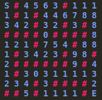
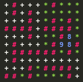

# Project 3.5
Welcome to project 3! In this week's project we will be going into an informed graph search algorithms: A*. A* (pronounced "A-star") is a graph traversal and path search algorithm, which is often used in many fields of computer science due to its completeness, optimality, and optimal efficiency.

# Introduction To A* Search Algorithm
A* is an informed search algorithm, or a best-first search, meaning that it is formulated in terms of weighted graphs: starting from a specific starting node of a graph, it aims to find a path to the given goal node having the smallest cost (least distance travelled, shortest time, etc.). It does this by maintaining a tree of paths originating at the start node and extending those paths one edge at a time until its termination criterion is satisfied.

At each iteration of its main loop, A* needs to determine which of its paths to extend. It does so based on the cost of the path and an estimate of the cost required to extend the path all the way to the goal. Specifically, A* selects the path that minimizes

```f(n)=g(n)+h(n)```

where n is the next node on the path, g(n) is the cost of the path from the start node to n, and h(n) is a heuristic function that estimates the cost of the cheapest path from n to the goal. A* terminates when the path it chooses to extend is a path from start to goal or if there are no paths eligible to be extended. The heuristic function is problem-specific. If the heuristic function is admissible, meaning that it never overestimates the actual cost to get to the goal, A* is guaranteed to return a least-cost path from start to goal.

Typical implementations of A* use a priority queue to perform the repeated selection of minimum (estimated) cost nodes to expand. This priority queue is known as the open set or fringe. At each step of the algorithm, the node with the lowest f(x) value is removed from the queue, the f and g values of its neighbors are updated accordingly, and these neighbors are added to the queue. The algorithm continues until a goal node has a lower f value than any node in the queue (or until the queue is empty). The f value of the goal is then the cost of the shortest path, since h at the goal is zero in an admissible heuristic.

The algorithm described so far gives us only the length of the shortest path. To find the actual sequence of steps, the algorithm can be easily revised so that each node on the path keeps track of its predecessor. After this algorithm is run, the ending node will point to its predecessor, and so on, until some node's predecessor is the start node.

As an example, when searching for the shortest route on a map, h(x) might represent the straight-line distance to the goal, since that is physically the smallest possible distance between any two points. For a grid map from a video game, using the Manhattan distance or the octile distance becomes better depending on the set of movements available (4-way or 8-way).

If the heuristic h satisfies the additional condition h(x) ≤ d(x, y) + h(y) for every edge (x, y) of the graph (where d denotes the length of that edge), then h is called monotone, or consistent. With a consistent heuristic, A* is guaranteed to find an optimal path without processing any node more than once and A* is equivalent to running Dijkstra's algorithm with the reduced cost d'(x, y) = d(x, y) + h(y) − h(x).

Illustration of A* search for finding path from a start node to a goal node. One can first see the A* moving in a straight line in the direction of the goal, then when hitting the obstacle, it explores alternative routes through the nodes from the open set.


## Pseudocode
```
function reconstruct_path(cameFrom, current)
    total_path := {current}
    while current in cameFrom.Keys:
        current := cameFrom[current]
        total_path.prepend(current)
    return total_path

// A* finds a path from start to goal.
// h is the heuristic function. h(n) estimates the cost to reach goal from node n.
function A_Star(start, goal, h)
    // The set of discovered nodes that may need to be (re-)expanded.
    // Initially, only the start node is known.
    // This is usually implemented as a min-heap or priority queue rather than a hash-set.
    openSet := {start}

    // For node n, cameFrom[n] is the node immediately preceding it on the cheapest path from start
    // to n currently known.
    cameFrom := an empty map

    // For node n, gScore[n] is the cost of the cheapest path from start to n currently known.
    gScore := map with default value of Infinity
    gScore[start] := 0

    // For node n, fScore[n] := gScore[n] + h(n). fScore[n] represents our current best guess as to
    // how short a path from start to finish can be if it goes through n.
    fScore := map with default value of Infinity
    fScore[start] := h(start)

    while openSet is not empty
        // This operation can occur in O(1) time if openSet is a min-heap or a priority queue
        current := the node in openSet having the lowest fScore[] value
        if current = goal
            return reconstruct_path(cameFrom, current)

        openSet.Remove(current)
        for each neighbor of current
            // d(current,neighbor) is the weight of the edge from current to neighbor
            // tentative_gScore is the distance from start to the neighbor through current
            tentative_gScore := gScore[current] + d(current, neighbor)
            if tentative_gScore < gScore[neighbor]
                // This path to neighbor is better than any previous one. Record it!
                cameFrom[neighbor] := current
                gScore[neighbor] := tentative_gScore
                fScore[neighbor] := gScore[neighbor] + h(neighbor)
                if neighbor not in openSet
                    openSet.add(neighbor)

    // Open set is empty but goal was never reached
    return failure
```
Source: [A* Wiki](https://en.wikipedia.org/wiki/A*_search_algorithm)

Other Resources: [AStar](http://theory.stanford.edu/~amitp/GameProgramming/AStarComparison.html)


# Problem
Similar to Project 3.4, suppose you are trapped in a 2D dungeon and you have to find the easiest way out. Hold on, we have some obstacles too. The dungeon is composed of unit cubes which may or may not be filled with rocks. It would take exactly one minute to move either east, west, south or north. You can’t move diagonally as the maze is tightly packed with solid rocks.



The dungeon has a size of R x C where R is number of rows and c is number of columns. We have to start at cell ‘S’ and we have an exit at cell ‘E’. The symbol (#) depicts the roadblocks in the route and numbers (0-9) shows a open routes; however, at a cost! The dungeon has become a weighted graph where the higher cell number the greater the cost/penalty assossicated with entering it. Lets just say that the higher the cell number, the more dangerous that cell is to enter.



It is our goal to find the safest path that leads to the exit by using A*.

## Code Setup
You have been given a decent amount bit of starter code to help you get going on this project.
- dungeon.cpp [ DO NOT EDIT ]: Loads dungeon map and prints path
- graph_search.cpp [ EDIT ]: Where you will write your A* implementation
    - Implement A* function (__A_star()__)
    - Implement heuristic function (__heuristic()__)
    - Implement reconstruct_path function (__reconstruct_path()__)
- test_cases/* [ CAN EDIT ]: Some dungeon testcases we provide, you can just copy/paste it into terminal when it asks to input dungeon map

## Test Your Code
A selection of test cases have been provided in the `test_cases` folder for this project. <br />
Example of running your code: <br />
```$ ./dungeon <verbose := True/False> ``` <br />
so an example command would be: <br />
```$ ./dungeon True ```

Then simply copy/paste one of test_cases text into the terminal and watch it run!

**Note:** When you mark a node as visited, make sure to set the corresponding grid cell to "*" so you can debug as you go. Also once you reach the exit node, iterate through the path nodes and set the corresponding grid cell to "+" for debugging.

Also, feel free to try editing the start/exit positions or the cell's cost values within the test cases and see how A* searches changes.
