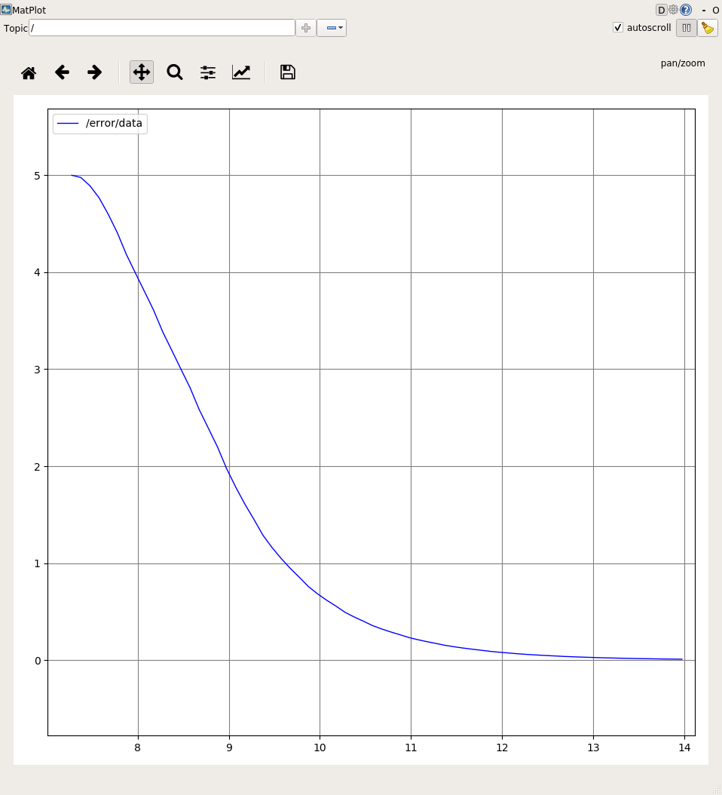

# Project 4.4
Welcome to Week 4 of robotics training exercises! We'll be learning about *PID*, *launch files* and get to work with the
simulator while we're at it and have some fun.

## Control Theory and PID
Let's start with the first robotics topic that we'll be learning today: *PID*. To understand *PID* though, we'll begin
with the motivation for PID: *Control Theory*.

### What is Control Theory
*Control Theory* is about being able to control some sort of *system* to do what we want it to do. That's quite a vague
definition, so let's use an example:

Say that you're trying to stop your car right in front of the stop sign. How do you do that? Intuitively, you would
gauge the distance, or *error*, between your current position and where you're trying to stop, and you would use that
information to help you decide how much throttle to give the car.

We call the thing that determines how much throttle to give the *controller*, which tries to bring the
*process variable (PV)* to equal the *set point (SP)* by changing the *control*. In the car example, the *PV* would be the car's position, and the
*SP* would be the position that's just in front of the stop sign, and the *control* is the throttle of the car.

### The PID algorithm - Proportional Controller
PID is one example of such a *controller* that is very simple but also very effective. PID stands for proportional,
integral, and derivative: three different kinds of *controllers*. We will begin with the proportional controller, which we
can understand in the context of the car example earlier:

Let's say there is some *error*, meaning that your car was some distance away from the stop sign. You would step on
the throttle to move your car forward. If there's a larger error, then you would step on the throttle more than then
if there was a smaller error. And finally, if there's no error, then you wouldn't step on the throttle at all.

Here the *control* (the throttle) is __proportional__ to the *error* (the distance).

<p align="center">
    
</p>

(`K_p` is just a constant and `e(t)` is a function of time. In the car example, `e(t)` would get smaller as the car approached the destination.)

### Compiling the Packages
To compile the `week_4_exercises` package, we need to put it into a catkin workspace. To compile the package, do the following:

- make a copy `week_4_exercises` and put it in your workspace's src directory.
- open a terminal and change directory to the workspace
- run `catkin_make`
The package should be compiled! If you run into problems, be sure to double check all your changes.

**NOTE:** Make sure that you compiled the `buzzsim` package as well. This can be done by putting the `buzzsim` package into the same workspace's `src` directory. You can clone [Buzzsim](https://github.com/RoboJackets/buzzsim.git) in your workspace if you don't have it by default in your VM.

### Exercise: Implementing a Proportional controller in ROS
Let's take the proportional controller that we've just learnt, and implement it in ROS. We'll be using the `buzzsim` simulator
that we installed at the beginning to showcase this.

#### Launching buzzsim with `roslaunch`
Before we start though, we've been using `rosrun` to launch all our nodes before, but this time we'll use `roslaunch`
to launch the simulator.
```bash
roslaunch week_4_exercises project_4_4_stationary.launch
```

You'll notice that the syntax here is quite similar to the syntax that we've used before with `rosrun` -
its got the package name `week_4_exercises`. However, instead of specifying the name of the node `buzzsim`, we
instead specify a `project_4_4_stationary.launch`.

#### The `buzzsim` environment for the exercise
After doing `roslaunch week_4_exercises project_4_4_stationary.launch`, you should see `buzzsim` open looking something like below:


Notice that there are two turtles. For this exercise, the goal will be to control the bottom turtle to minimize the
distance between the two turtles. To do this, we will be using the *PID controller* from earlier.

#### Relevant rostopics and the message types
First thing we need to do is find out what kind of data we have access to. Find out the topics that are available and
the message types for those topics.
[Hint](#spoiler 'You can find out both pieces of information using the "rostopic" tool.')
[Answer](#spoiler '"rostopic list" to find out what topics are available, then "rostopic info {NAME OF TOPIC}" to find
out the message type.')

The rostopics that we will need to use are the following:
```
/oswin/velocity - Publish to this to send velocity commands to the bottom turtle
/oswin/ground_truth - Subscribe to this to get information about where the bottom turtle is

/kyle/ground_truth - Subscribe to this to get information about where the top turtle is
```

#### Writing a proportional controller
Implement the proportional controller in [pid_node.cpp](pid_node.cpp).

##### Subscribe to the ground truth topics for both turtles
The first thing we need to do is to subscribe to the `/oswin/ground_truth` and `/kyle/ground_truth` topics. For the
message from `/kyle/ground_truth`, save the message to a global variable called `kyle_pose_`, so that you can use the
information in the callback for `/oswin/ground_truth`. For now, use `ROS_INFO_STREAM` in both callbacks to print out the
x coordinate of each turtle to double-check that your callbacks are working.

Make sure to include the message type. If the message type was `a/b`, then you would `#include<a/b.h>`. CLion's
auto-correct should help you here.

##### Publish to the `/oswin/velocity` topic to control the bottom turtle
The next task is to create a `ros::Publisher` for the `/oswin/velocity` topic so that we can control the bottom turtle.
Put this publisher in the global variable `velocity_pub_` so that we can access it in the callback for
`/oswin/ground_truth`.

##### Implement a proportional controller in the callback for `/oswin/ground_truth`
Now its time to implement a controller. We'll start with the proportional controller.
<ol>
<li>Calculate the error in x-coordinate between the two turtles.</li>
<li>Calculate

</li>
<li>Publish

to the publisher you created earlier</li>
</ol>

With `Kp = 1`, after you compile and `roslaunch` you should then see the bottom turtle move up and stop exactly where
top turtle is.

Try experimenting with different values of `Kp` to see what happens. Try `Kp = 10`, what happens? Note that you'll need to recompile every time you
change the value.


#### Visualizing data with `rqt_plot`
It would be useful to be able to visualize the error by plotting a graph of it. Create a publisher of type
`std_msgs::Float64` on the topic "error", then publish the error variable that you calculated in the callback for `/oswin/ground_truth`.
How can you verify that it is publishing correctly?
[Hint](#spoiler 'You can try seeing whats being published on the topic. "rostopic" is your friend.')
[Answer](#spoiler 'rostopic echo /error')

ROS comes with the tool `rqt_plot` that's useful for plotting graphs and visualizing data. Open the tool:
```bash
rqt_plot
```

To add the `/error` topic to the graph, type `/error` at the top. Now try launching the simulation and the controller.
You should see a graph like below:


Try playing with `Kp` again, and verify that the graph shows what you see happening in the simulator.

### The PID Algorithm - Integral Controller
However, there's a problem. Let's say that instead of trying to move the car to just in front of the stop sign, we're
trying to catch up to a car that's driving away from us. If we start off with some error such that

is equal to the target car's velocity, then our car is going to be going at the same velocity as the target car, and
the error isn't going to decrease.

Intuitively though, if you were trying to catch up to a car and you saw that the error was still present after a while,
you would begin to step harder on the throttle. The longer you see that the error is present, the harder you step on the
throttle.

One way to describe this behavior would be to say that we have a component of our control that is proportional
to the *integral* of the error: As the error stays present for longer, we're going to increase our control effort.

This is an *integral controller*, where the *control* is proportional to the __integral__ of the *error*.

<p align="center">
    
</p>

It's easier to think of this in terms of **discrete** time, where time happens in small steps, as this is how a computer
works. Instead of computing an integral, we compute a sum of the error and multiply it by the time step between each
interval:

<p align="center">
    
</p>

or calculating recursively

<p align="center">
    
</p>

### Exercise: A moving target, and implementing an integral controller
Let's try a moving target this time. Do this by running `roslaunch week_4_exercises project_4_4_moving.launch`

Now if you `roslaunch` again, you should see the top turtle start to move. Does your proportional controller work?
Verify what you're seeing by checking `rqt_plot`.

The error that you're seeing is called **steady state error**. As we explained earlier, the integral controller helps
to solve this.
<details>
  <summary>Implement an integral controller</summary>

  Implement an integral controller then use the sum of both the proportional and integral controllers as the controller
  output.

  [Hint 1](#spoiler 'To integrate, you will need two things: an accumulator variable, as well as a way to calculate the
  the time between the current message and the past message. The ros::Time type and ros::Time::now() should be helpful.
  You will need to create a global variable to store the previous time.')
  [Hint 2](#spoiler 'The ros::Time variable initializes with all zeros, which is the wrong time. You can use a global
  boolean like last_msg_time_, and then set your previous_time variable to the current time if its not initialized')

  You should be able to eliminate the steady state error now.
</details>

### The PID Algorithm - Derivative Controller
And finally, imagine we're back in the first scenario where we're trying to stop right in from the stop sign. If we were
only using our *proportional controller*, even when we're just about to get to the stop sign, we would still have our
foot on the throttle, even if it was a small amount. This would result in the car overshooting the stop sign, and then
our *proportional controller* would tell us to reverse, and the same thing would happen until eventually getting to the
stop sign.

However, this isn't something that you would do in real life. Assume that we're driving a really heavy truck. You might
step on the throttle at the beginning to get the truck moving, but as the truck is moving faster, you would use the
throttle less to stop yourself from overshooting. The faster you happen to be moving, the more you would ease off of the
throttle, or even use the brakes to slow yourself down a bit.

To describe this behavior we can say that there's a component of our control that is proportional to the *derivative* of
the error, so that the faster the error is decreasing, the more we ease off on our *control*.

This is a *derivative controller*, where the *control* is proportional to the __derivative__ of the *error*.

<p align="center">
    
</p>

For the **continuous** version, calculate the derivative with **finite differences**:

<p align="center">
    
</p>

#### Finishing up PID: Adding the derivative controller
Now that we've got both proportional and integral, its time to add the final part: derivative.

#### Putting it all together
The PID controller is just the three controllers above combined, and stands for (as you've probably guessed)
*Proportional, Integral, Derivative*.

And by putting the three equations for control output above, we get:

<p align="center">
    
</p>

where **u** stands for the _control output_.


## Summary
And that's it for this week!

We've learnt about:
- [PID control and basic control theory](#the-pid-algorithm---proportional-controller)
    + Controlling a **Process Variable** to equal some **Set Point**
    + The **P**roportional **I**ntegral **D**erivative algorithm as a simple controller
    + Understanding what a controller does in the context of a car
- [Written our own PID controller](#exercise-implementing-a-proportional-controller-in-ros)
    + Implementing something we just learnt about in theory!
    + And it works!
