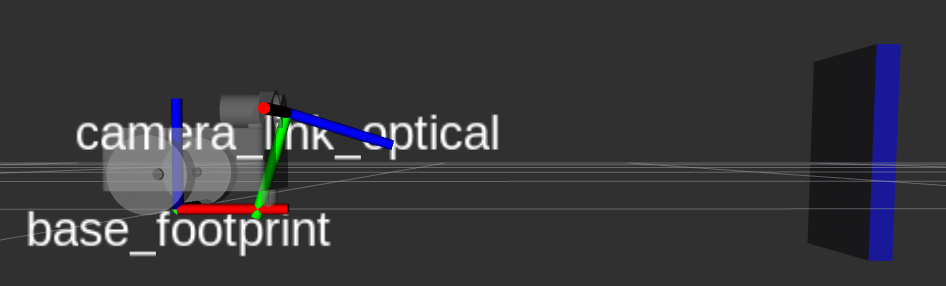

<!--
STOP
We strongly recommend viewing this file with a rendered markdown viewer. You can do this by:
 - Opening this file in the GitHub web viewer
 - Pressing Ctrl+Shift+V in Visual Studio Code
 - Opening this file in any other markdown viewer you prefer
-->

# Week 1 Project: Coordinate Frame Transformations

<!-- START doctoc generated TOC please keep comment here to allow auto update -->
<!-- DON'T EDIT THIS SECTION, INSTEAD RE-RUN doctoc TO UPDATE -->
## Contents

- [1 Background](#1-background)
- [2 Instructions](#2-instructions)
  - [2.1 Get the latest starter code](#21-get-the-latest-starter-code)
  - [2.2 Test the simulator](#22-test-the-simulator)
  - [2.3 Add new include statements](#23-add-new-include-statements)
  - [2.4 Implement the transformation matrix helper function](#24-implement-the-transformation-matrix-helper-function)
  - [2.5 Make a vector to hold our transformed tags](#25-make-a-vector-to-hold-our-transformed-tags)
  - [2.6 Write a loop over the old tags](#26-write-a-loop-over-the-old-tags)
  - [2.7 Transform tag position](#27-transform-tag-position)
  - [2.8 Transform tag orientation](#28-transform-tag-orientation)
  - [2.9 Build project](#29-build-project)
  - [2.10 Run project](#210-run-project)
  - [2.11 Commit your new code in git](#211-commit-your-new-code-in-git)

<!-- END doctoc generated TOC please keep comment here to allow auto update -->

## 1 Background

This week's robotics theory videos covered the basics of coordinate frames. We will be practicing the math covered in order to transform a measurement coming from a camera to the body frame of the robot.

Our robot uses a camera to track ArUco tag fiducials. We'll be using these detections in a later project to track our robot's position. For now, we just want to take these detections, which are measured in the camera's optical frame, and transform them to the robot's "base_footprint" frame. This will give you a glimpse into the process used to track objects against different reference frames.

Here's an example ArUco tag fiducial. This one represents the number 0.


To get a better sense of the transformation we'll be doing, take a look at this visual of the two frames we'll be using.



The measurements will come in with positions relative to the "camera_link_optical" frame. In this case, you can see that the tag (shown as a blue box) would have a position that's mostly in the positive Z (blue axis) direction. We'll transform the measurements into the "base_footprint" frame, which represents the point on the floor underneath the center point between the drive wheels. Again, in the diagram you can see that, relative to the "base_footprint" frame, our tag's position would mostly be in the positive X (red axis) direction.

To be clear, the tag's position in the real world isn't changing. We're just measuring it from different origin points.

For this project, we'll be writing code in the [coordinate_transform](../../coordinate_transform) package. The starter code for this project features a ROS node. This node, `CoordinateTransformComponent`, subscribes to a topic, "~/tags", which provides raw tag detections from the camera. It transforms these tags into the "base_footprint" frame (using code you'll write) and publishes the transformed detections onto another topic, "~/tags_transformed." You'll be filling in the code that creates a transformation matrix and applies that matrix to the detected tag positions.

To test our code, we'll use rviz to visualize both the original tag detections and our transformed tag detections. rviz can render data in multiple reference frames, and will do the transformation math internally. This means that if we do our transformations correctly, both the original and transformed tags will show up in the same place in the rviz 3D rendered world.

## 2 Instructions

### 2.1 Get the latest starter code

To make sure you're starting with the latest starter code, pull from the git server in your copy of the software-training repository.

```bash
$ cd training_ws/src/software-training
$ git pull
```

You'll also want to make sure you've got the latest version of the training support library by running an apt package update.

```bash
$ sudo apt update
$ sudo apt upgrade
```

### 2.2 Test the simulator
   
Before we start writing code, let's take a moment to introduce you to the robot simulator. To start the simulator, launch the `traini_simulation.launch.py` file in the `traini_bringup` package.

<!-- TODO(barulicm) Should we put all launch files that the students use directly in rj_training_bringup for consistency? ie
ros2 launch rj_training_bringup simluator.launch.py -->
```bash
$ ros2 launch traini_bringup traini_simulation.launch.py
```

**Tip:** Don't forget to source your ROS underlay first with `source /opt/ros/foxy/setup.bash`.

You should now see Gazebo with the virtual world we'll be using for our projects.


There are two ways to manually drive the robot around. The first uses the `teleop_twist_keyboard` package to drive the robot with your keyboard. To do this, run the `teleop_twist_keyboard` node.

```bash
$ ros2 run teleop_twist_keyboard teleop_twist_keyboard
```

Now you should be able to follow the instructions it prints to drive the robot around.

The other way you can drive the robot is using a gamepad, like an XBox controller. To start the joystick control nodes, launch the `joystick_control.launch.py` file.

```bash
$ ros2 launch traini_bringup joystick_control.launch.py
```

You should now be able to drive the robot, using the left joystick to drive forward/backward and the right joystick to turn.

After you've driven your robot around for a bit, select (from the menu bar) `Edit -> Reset Model Poses` to move the robot back to its starting position. This is a good trick to know to reset your simulator.

You can now close the simulator window, or press Ctrl+c in the terminal.

*Bonus:* [How to fix gamepad mappings](CustomGamepadMappings.md)

### 2.3 Add new include statements

Now we'll move on to writing some code. Our first task is to include two new headers for containers we'll be using in this project: `std::array` and `std::vector`.

Open up [coordinate_transform_components.cpp](../../coordinate_transform/src/coordinate_transform_component.cpp), and locate the set of include statements at the top of the file.

**Tip** We'll mark locations in the starter code where you'll need to add code with `// BEGIN STUDENT CODE` and `// END STUDENT CODE`.

In the marked student code section, add two lines to include the new headers. You'll need to include `<array>` and `<vector>`.

With that done, we can now use those containers in this file.

### 2.4 Implement the transformation matrix helper function

Next, we'll implement the `getTransformationMatrixForOpticalFrame()` helper function. This function has been started for you towards the bottom of the file.

This function needs to create a transformation matrix that captures the rotation between the camera's optical frame and the camera's conventional frame.

Optical frames have their Z-axis pointing "forward", their X-axis pointing "right", and their Y-axis pointing "down". This lines up with the conventions used in computer vision math.

ROS conventions use a different axis orientation. In ROS conventional frames, the X-axis points "forward", the Y-axis points "left", and the Z-axis points "up".

To build the transformation between these two frames, we'll combine to simple rotation transformations.

To turn out linear algebra math into C++ code, we'll be using the popular [Eigen library](https://eigen.tuxfamily.org). Covering the details of using this library is beyond the scope of this training, so we'll walk you through the Eigen code you need to write.

To implement the `getTransformationMatrixForOpticalFrame()` function, we need to create two 4x4 Eigen matrices and multiply them together. Start by declaring and initializing two `std::array` variables to hold the numbers that will populate our matrices. Name them `R_roll_data` and `R_yaw_data`. Both should contain 16 elements of type `double`.

<details>
<summary><b>Hint:</b> Declaring and initializing a <code>std::array</code></summary>
<p>Here's how you would declare and initialize a <code>std::array</code> that stores three doubles.</p>
<pre><code>std::array&ltdouble, 3&gt my_array = {0, 0, 0};</code></pre>
</details>

These arrays hold the data for our transformation matrices in what's called "row order". This is a technique for holding a 2-dimensional structure like a matrix in a 1-dimensional container. The array holds the elements of each row in order from left to right, and top to bottom. So, the following 3x3 matrix:

<table style="border-collapse:collapse">
<tr> <td>1</td> <td>0</td> <td>0</td> </tr>
<tr> <td>0</td> <td>1</td> <td>0</td> </tr>
<tr> <td>0</td> <td>0</td> <td>1</td> </tr>
</table>

Can be represented in row order by this array:

<code>{ 1, 0, 0, 0, 1, 0, 0, 0, 1 }</code>

Now, fill out your arrays with the correct values to represent a rotation transformation matrix. `R_roll_data` should represent a rotation of &pi;/2 radians about the X axis. `R_yaw_data` should represent a rotation of &pi;/2 radians about the Z axis.

<details>
<summary><b>Hint:</b> Pure rotation transformation matrices</summary>
<p>Transformation matrices that only represent a rotation have translation parts that are all zeros. The top-left 3x3 block of the transfomation matrix is then filled in as a 3x3 rotation matrix.</p>
<p>Rotation about the X axis:</p>
<table style="border-collapse:collapse">
<tr> <td>1</td> <td>0</td> <td>0</td> <td>0</td> </tr>
<tr> <td>0</td> <td>cos(&Theta;)</td> <td>-sin(&Theta;)</td> <td>0</td> </tr>
<tr> <td>0</td> <td>sin(&Theta;)</td> <td>cos(&Theta;)</td> <td>0</td> </tr>
<tr> <td>0</td> <td>0</td> <td>0</td> <td>1</td> </tr>
</table>
<p>Rotation about the Y axis:</p>
<table style="border-collapse:collapse">
<tr> <td>cos(&Theta;)</td> <td>0</td> <td>sin(&Theta;)</td> <td>0</td> </tr>
<tr> <td>0</td> <td>1</td> <td>0</td> <td>0</td> </tr>
<tr> <td>-sin(&Theta;)</td> <td>0</td> <td>cos(&Theta;)</td> <td>0</td> </tr>
<tr> <td>0</td> <td>0</td> <td>0</td> <td>1</td> </tr>
</table>
<p>Rotation about the Z axis:</p>
<table style="border-collapse:collapse">
<tr> <td>cos(&Theta;)</td> <td>-sin(&Theta;)</td> <td>0</td> <td>0</td> </tr>
<tr> <td>sin(&Theta;)</td> <td>cos(&Theta;)</td> <td>0</td> <td>0</td> </tr>
<tr> <td>0</td> <td>0</td> <td>1</td> <td>0</td> </tr>
<tr> <td>0</td> <td>0</td> <td>0</td> <td>1</td> </tr>
</table>
</details>

Next, let's create `Eigen::Matrix4d` objects using our data arrays:

```c++
Eigen::Matrix4d R_roll(R_roll_data.data());
Eigen::Matrix4d R_yaw(R_yaw_data.data());
```

Finally, modify the return statement to return the result of `R_yaw * R_roll`.

### 2.5 Make a vector to hold our transformed tags

Now we're going to start writing the code that uses the helper function we just implemented in the previous section to transform the incoming tags.

Look for the `DetectionCallback()` function. This function gets called each time our node receives a message on the "~/tags" topic. This topic uses `TagArray` messages (defined in the stsl_interfaces package). Each message contains a set of multiple tag detections, so to transform all of them we'll need to iterate over the incoming message and populate a new `TagArray` message with the results.

Let's create a `std::vector` to hold our transformed tags.

Locate the student code block in `DetectionCallback()` (should be around line 84). Here, declare a `std::vector` called `new_tags` that contains elements of type `stsl_interfaces::msg::Tag`.

A few lines down, you'll see another student code block with this comment:

```c++
// set message tags to new_tags vector
```

We're going to do exactly what the comment says. Add a line that sets `msg`'s `tags` member to our `new_tags` vector.

```c++
new_tag_array_msg.tags = new_tags;
```

### 2.6 Write a loop over the old tags

Now that we have a container to put our transformed tags into, we need to loop over the container of old tags and, for each one, push a new tag into `new_tags`.

Starting on the line after your `new_tags` declaration, add a for loop that iterates over `tag_array_msg->tags`. Because we're looping over the whole container of tags, we can use a range-based for loop. And because we only want to read the tags in the incoming message, our loop variable can be constant. The loop should look like this:

```
for(const auto tag : tag_array_msg->tags) {

}
```

In the body of this new loop, declare a variable named `new_tag` of type `stsl_interfaces::msg::Tag`. Then, copy the `id` member of the current old tag into `new_tag.id` like this:

```c++
new_tag.id = tag.id;
```

Finally, at the end of the loop body use `push_back()` to add `new_tag` to the `new_tags` vector.

### 2.7 Transform tag position

We now have two transformations we need to apply to our tags. The first we grabbed for you from the ROS TF system (which we'll cover in detail later). This is `camera_to_base_transform`, which transforms things from the camera's conventional frame to the robot's base frame. The second transform, `camera_optical_to_conventional_transform` is the rotation transformation you created in the `getTransformationMatrixForOpticalFrame()` function. Our objective is to transform all of the tag detections from the camera's optical frame to the robot's base frame, so we need to apply both of these transformations to the position and orientation of each tag. In this section, we'll handle the position.

Let's start by creating a homogeneous vector for our tag's position. In the body of our for loop, after the line that copies the tag ID, declare a variable of type `Eigen::Vector4d`, named `position`. Initialize `position` by passing, to its constructor, the x, y, and z coordinates from the old tag's pose, and 1 for the final element. That will look like this:

```c++
Eigen::Vector4d position(
  tag.pose.position.x,
  tag.pose.position.y,
  tag.pose.position.z,
  1
);
```

Now, apply the transformations by multiplying the transformation objects, `camera_to_base_transform` and `camera_optical_to_conventional_transform`, with `position`. Assign the result of that multiplication back to `position`. Remember, the order of this multiplication matters. Be sure to apply `camera_optical_to_conventional_transform` before `camera_to_base_transform`.

<details>
<summary><b>Hint:</b> Ordering transformations</summary>
<p>Transforms that are applied first should appear on the right of a multiplication chain. To apply A, then B, then C, we would write <code>C * B * A</code>.</p>
</details>

The last thing we need to do for this section is to copy the new position's coordinates into the `new_tag` message. Copying the x value looks like this:

```c++
new_tag.pose.position.x = position.x();
```

Do the same for y and z.

### 2.8 Transform tag orientation

To transform the tag's orientation, we're going to follow a similar process. We'll start by extracting the rotation from the old tag message. We've provided a function to help you with this. `quaternionMessageToTransformationMatrix()` will take in a quaternion from a ROS message, and return a 4x4 transformation matrix that represents the rotation. The translation part of this matrix will be all zeros and won't really matter while we're treating it as a pure rotation.

Declare a variable named `tag_orientation` of type `Eigen::Matrix4d` right after you position code. Initialize `tag_orientation` by calling `quaternionMessageToTransformationMatrix()`, passing it `tag.pose.orientation`.

Now, apply both transformations to `tag_orientation`. This should look basically identical to how you applied the transformations to `position`.

Finally, we need to convert our new orientation back into a quaternion message and set it in the `new_tag` message. Here again, we've got a helper function for you called `transformationMatrixToQuaternionMessage()`. Call this function, passing `tag_orientation`, and assign the result to `new_tag.pose.orientation`.

And that's it! We've written all the code we need to make this node complete.

### 2.9 Build project

Before we can run our newly finished node, we need to build it. Open a terminal window and navigate to the training workspace folder (`/home/robojackets/training_ws`).

Source the underlay setup script:

```bash
$ source /opt/ros/foxy/setup.bash
```

And use colcon to build the workspace

```bash
$ colcon build
```

If your build succeeded, the last line printed will be `Summary: __ packages finished [_.__s]` that tells you how many packages were built and how long the process took.

If any errors were found during the build, the final summary will tell you, and the output will include the error details. The summary of a failed build looks like this:

```bash
Summary: 16 packages finished [5.12s]
  1 package failed: coordinate_transform
  1 package had stderr output: coordinate_transform
```

If you do have any errors, you'll need to fix them before you can run your node. We recommend starting with the first error reported, reading the error message carefully, fixing it, and building again. Repeat that process until all errors are resolved. Of course, if you're not sure how to fix any given error, reach out to the trainers.

### 2.10 Run project

To run this project, we'll need two terminal windows or tabs.

In both terminals, you'll need to start by sourcing the underlay setup file and the training workspace overlay setup file.

```bash
source /opt/ros/foxy/setup.bash
source ~/training_ws/install/setup.bash
```

In the first terminal, launch the week 1 launch file.

```bash
ros2 launch rj_training_bringup week_1.launch.xml
```

This will open up the simulator and a pre-configured rviz instance. A number of other nodes will also be started in the background, including the coordinate transform node you wrote!

In the second terminal, we need to run a node that can drive the robot around. You can either use keyboard control or joystick control.

For joystick control:

```bash
$ ros2 launch traini_bringup joystick_control.launch.py
```

Or, for keyboard control:

```bash
$ ros2 run teleop_twist_keyboard teleop_twist_keyboard
```

Now you should be able to drive the robot around and see the tag detections visualized in the rviz window.

If everything's working correctly, you'll see something like this the gif below. The blue box is where the tag actually is, and the green box is where your code says it is. If your code is correct, the two boxes should completely overlap, looking like one teal box.


Here's an example of what things might look like if something's not right. In this case, the rotation matrices weren't setup correctly.


### 2.11 Commit your new code in git

Once you've got your code for this project working, use the command below to commit it into git. This will make it easier to grab changes to the starter code for the remaining projects.

```bash
$ git commit -a -m "My project 1 code."
```
