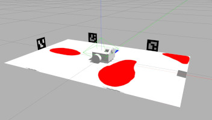
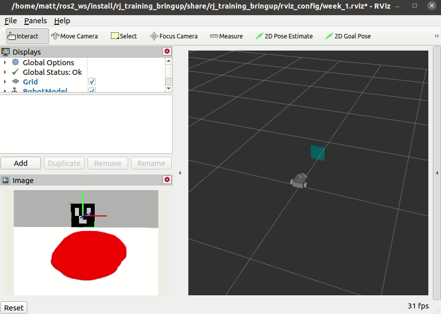
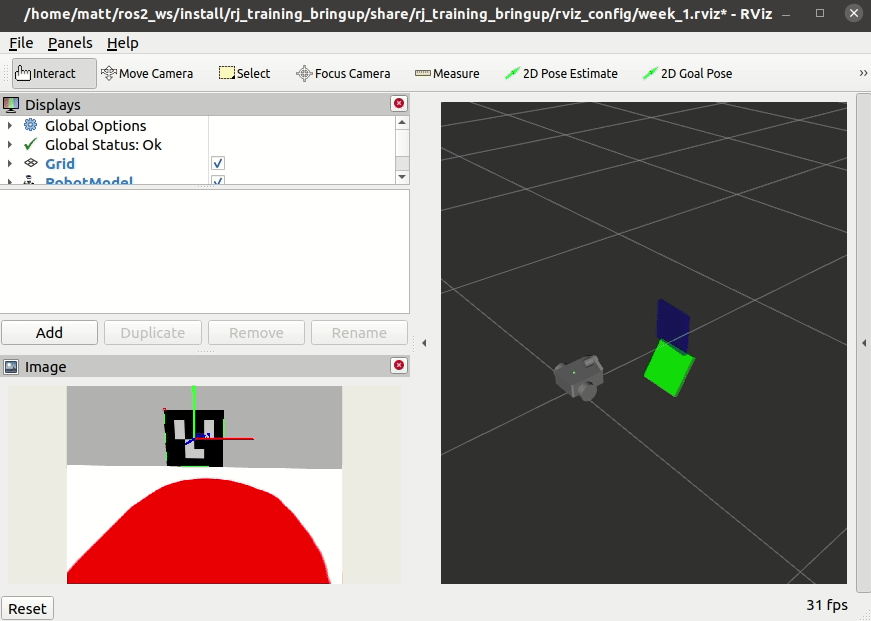

<!--
STOP
We strongly recommend viewing this file with a rendered markdown viewer. You can do this by:
 - Opening this file in the GitHub web viewer
 - Pressing Ctrl+Shift+V in Visual Studio Code
 - Opening this file in any other markdown viewer you prefer
-->


# Week 1 Project: Coordinate Frame Transformations

## Table of Contents
- [1 Background](#1-background)
- [2 How to Run](#2-how-to-run)
- [3 Instructions](#3-instructions)
  - [3.1 Test the simulator](#31-test-the-simulator)
  - [3.2 Add new include statements](#32-add-new-include-statements)
  - [3.3 Implement the rotation matrix helper function](#33-implement-the-rotation-matrix-helper-function)
  - [3.4 Make a vector to hold our transformed tags](#34-make-a-vector-to-hold-our-transformed-tags)
  - [3.5 Write a loop over the old tags](#35-write-a-loop-over-the-old-tags)
  - [3.6 Transform tag position](#36-transform-tag-position)
  - [3.7 Transform tag orientation](#37-transform-tag-orientation)
  - [3.8 Build project](#38-build-project)
  - [3.9 Run project](#39-run-project)

## 1 Background

Explain context and purpose of the exercise

## 2 How to Run

Explain how to launch relevant files. Demonstrate that the robot can't do the desired behavior with the starter code.

## 3 Instructions

Provide the step by step instructions for modifying the code

### 3.1 Test the simulator
   
Before we start writing code, let's take a moment to introduce you to the robot simulator. To start the simulator, launch the `traini_simulation.launch.py` file in the `traini_bringup` package.

```bash
$ ros2 launch traini_bringup traini_simulation.launch.py
```

**Tip:** Don't forget to source your ROS underlay with `source /opt/ros/foxy/setup.bash`.

You should now see Gazebo with the virtual world we'll be using for our projects.



There are two ways to manually drive the robot around. The first uses the `teleop_twist_keyboard` package to drive the robot with your keyboard. To do this, run the `teleop_twist_keyboard` node.

```bash
$ ros2 run teleop_twist_keyboard teleop_twist_keyboard
```

Now you should be able to follow the instructions it prints to drive the robot around.

The other way you can drive the robot is using a gamepad, like an XBox controller. To start the joystick control nodes, launch the `joystick_control.launch.py` file.

```bash
$ ros2 launch traini_bringup joystick_control.launch.py
```

You should now be able to drive the robot, using the left joystick to drive forward/backward and the right joystick to turn.

After you've driven your robot around for a bit, select (from the menu bar) `Edit -> Reset Model Poses` to move the robot back to its starting position. This is a good trick to know to reset your simulator.

You can now close the simulator window, or press Ctrl+c in the terminal.

*Bonus:* [How to fix gamepad mappings](CustomGamepadMappings.md)

### 3.2 Add new include statements

Now we'll move on to writing some code. Our first task is to include two new headers for containers we'll be using in this project: `std::array` and `std::vector`.

Locate the include block at the top of the file.

**Tip** We'll mark locations in the starter code where you'll need to add code with `// BEGIN STUDENT CODE` and `// END STUDENT CODE`.

In the marked student code section, add two lines to include the new headers. You'll need to include `<array>` and `<vector>`.

With that done, we can now use those containers in this file.

### 3.3 Implement the rotation matrix helper function

Next, we'll implement the `getRotationMatrixForOpticalFrame()` helper function. Locate this function towards the end of this file:

`~/training_ws/src/software-training/coordinate_transform/src/coordinate_transform.cpp`


This function will create and combine two rotation matrices to create a final transformation matrix that maps from the camera's optical frame to the camera's conventional frame.

Start by declaring and initializing two `std::array` variables, called `R_roll_data` and `R_yaw_data`. Both should contain 16 elements of type `double`.

<details>
<summary><b>Hint:</b> Declaring and initializing a <code>std::array</code></summary>
<p>Here's how you would declare and initialize a <code>std::array</code> that stores three doubles.</p>
<pre><code>std::array&ltdouble, 3&gt my_array = {0, 0, 0};</code></pre>
</details>

These arrays will contain the data for our rotation matrices in what's called "row order". This is a technique for holding a 2-dimensional structure like a matrix in a 1-dimensional container. The array will contain the elements of each row in order from left to right, and top to bottom. So, the following 3x3 matrix:

<table style="border-collapse:collapse">
<tr> <td>1</td> <td>0</td> <td>0</td> </tr>
<tr> <td>0</td> <td>1</td> <td>0</td> </tr>
<tr> <td>0</td> <td>0</td> <td>1</td> </tr>
</table>

Can be represented in row order by this array:

<code>{ 1, 0, 0, 0, 1, 0, 0, 0, 1 }</code>

Now, fill out your arrays with the correct values to represent a rotation transformation matrix. `R_roll_data` should represent a rotation of &pi;/2 radians about the X axis. `R_yaw_data` should represent a rotation of &pi;/2 radians about the Z axis.

**Tip:** In C++, you can use the special constant `M_PI` to get the value of &pi;.

<details>
<summary><b>Hint:</b> Rotation matrices</summary>
<p>Rotation about the X axis:</p>
<table style="border-collapse:collapse">
<tr> <td>1</td> <td>0</td> <td>0</td> <td>0</td> </tr>
<tr> <td>0</td> <td>cos(&Theta;)</td> <td>-sin(&Theta;)</td> <td>0</td> </tr>
<tr> <td>0</td> <td>sin(&Theta;)</td> <td>cos(&Theta;)</td> <td>0</td> </tr>
<tr> <td>0</td> <td>0</td> <td>0</td> <td>1</td> </tr>
</table>
<p>Rotation about the Y axis:</p>
<table style="border-collapse:collapse">
<tr> <td>cos(&Theta;)</td> <td>0</td> <td>sin(&Theta;)</td> <td>0</td> </tr>
<tr> <td>0</td> <td>1</td> <td>0</td> <td>0</td> </tr>
<tr> <td>-sin(&Theta;)</td> <td>0</td> <td>cos(&Theta;)</td> <td>0</td> </tr>
<tr> <td>0</td> <td>0</td> <td>0</td> <td>1</td> </tr>
</table>
<p>Rotation about the Z axis:</p>
<table style="border-collapse:collapse">
<tr> <td>cos(&Theta;)</td> <td>-sin(&Theta;)</td> <td>0</td> <td>0</td> </tr>
<tr> <td>sin(&Theta;)</td> <td>cos(&Theta;)</td> <td>0</td> <td>0</td> </tr>
<tr> <td>0</td> <td>0</td> <td>1</td> <td>0</td> </tr>
<tr> <td>0</td> <td>0</td> <td>0</td> <td>1</td> </tr>
</table>
</details>

Next, let's create `Eigen::Matrix4d` objects using our data arrays:

```c++
Eigen::Matrix4d R_roll(R_roll_data.data());
Eigen::Matrix4d R_yaw(R_yaw_data.data());
```

Finally, modify the return statement to return the result of `R_yaw` multiplied by `R_roll`.

### 3.4 Make a vector to hold our transformed tags

Let's create a `std::vector` to hold our transformed tags.

Locate the student code block in `DetectionCallback()` (should be around line 82). Here, declare a `std::vector` called `new_tags` that contains elements of type `stsl_interfaces::msg::Tag`.

A few lines down, you'll see another student code block with this comment:

```c++
// set message tags to new_tags vector
```

We're going to do exactly what the comment says. Add a line that sets `msg`'s `tags` member to our `new_tags` vector.

```c++
new_tag_array_msg.tags = new_tags;
```

### 3.5 Write a loop over the old tags

Now that we have a container to put our transformed tags into, we need to loop over the container of old tags and, for each one, push a new tag into `new_tags`.

Starting on the line after your `new_tags` declaration, add a for loop that iterates over `tag_array_msg->tags`.

**Tip:** You can get the count of elements in a `std::vector` by calling its `size()` method.

<details>
<summary><b>Hint:</b> For loops</summary>
<p>You can write a for loop that iterates from `i=0` to `i=9` like this:</p>
<pre><code>for(int i = 0; i < 10; ++i)
{
   // body of loop
}</code></pre>
</details>

In the body of this new loop, declare a variable named `new_tag` of type `stsl_interfaces::msg::Tag`. Then, copy the `id` member of the current old tag into `new_tag.id` like this:

```c++
new_tag.id = tag_array_msg->tags[i].id;
```

Finally, at the end of the loop body use `push_back()` to add `new_tag` to the `new_tags` vector.

### 3.6 Transform tag position

We now have two transformations we need to apply to our tags. The first we grabbed for you from the ROS TF system (which we'll cover in detail later). This is `camera_to_base_transform`, which transforms things from the camera's conventional frame to the robot's base frame. The second transform, `camera_optical_to_conventional_transform` is the rotation transformation you created in the `getRotationMatrixForOpticalFrame()` function. Our objective is to transform all of the tag detections from the camera's optical frame to the robot's base frame, so we need to apply both of these transformations to the position and orientation of each tag. In this section, we'll handle the position.

Let's start by creating a homogeneous vector for our tag's position. In the body of our for loop, after the `new_tag.id = old_tag.id;` line, declare a variable of type `Eigen::Vector4d`, named `position`. Initialize `position` by passing, to its constructor, the x, y, and z coordinates from the old tag's pose, and 1 for the final element. That will look like this:

```c++
Eigen::Vector4d position(
  old_tag.pose.position.x,
  old_tag.pose.position.y,
  old_tag.pose.position.z,
  1
);
```

Now, apply the transformations by multiplying the transformation objects, `camera_to_base_transform` and `camera_optical_to_conventional_transform`, with `position`. Assign the result of that multiplication back to `position`. Remember, the order of this multiplication matters. Be sure to apply `camera_optical_to_conventional_transform` before `camera_to_base_transform`.

The last thing we need to do for this section is to copy the new position's coordinates into the `new_tag` message. Copying the x value looks like this:

```c++
new_tag.pose.position.x = position.x();
```

Do the same for y and z.

### 3.7 Transform tag orientation

To transform the tag's orientation, we're going to follow a similar process. We'll start by extracting the rotation from the `old_tag` message. We've provided a function to help you with this. Declare a variable named `tag_orientation` of type `Eigen::Matrix4d` right after you position code. Initialize `tag_orientation` by calling `quaternionMessageToTransformationMatrix()`, passing it `old_tag.pose.orientation`.

Now, apply both transformations to `tag_orientation`. This should look basically identical to how you applied the transformations to `position`.

Finally, we need to convert our new orientation back into a quaternion message and set it in the `new_tag` message. Here again, we've got a helper function for you called `transformationMatrixToQuaternionMessage()`. Call this function, passing `tag_orientation`, and assign the result to `new_tag.pose.orientation`.

And that's it! We've written all the code we need to make this node complete.

### 3.8 Build project

Before we can run our newly finished node, we need to build it. Open a terminal window and navigate to the training workspace folder (`/home/robojackets/training_ws`).

Source the underlay setup script:

```bash
$ source /opt/ros/foxy/setup.bash
```

And use colcon to build the workspace

```bash
$ colcon build
```

If your build succeeded, the last line printed will be `Summary: __ packages finished [_.__s]` that tells you how many packages were built and how long the process took.

If any errors were found during the build, the final summary will tell you, and the output will include the error details. The summary of a failed build looks like this:

```bash
Summary: 16 packages finished [5.12s]
  1 package failed: coordinate_transform
  1 package had stderr output: coordinate_transform
```

If you do have any errors, you'll need to fix them before you can run your node. We recommend starting with the first error reported, reading the error message carefully, fixing it, and building again. Repeat that process until all errors are resolved. Of course, if you're not sure how to fix any given error, reach out to the trainers.

### 3.9 Run project

To run this project, we'll need two terminal windows or tabs.

In the first terminal, after sourcing the underlay setup file and the training workspace overlay setup file, launch the week 1 launch file.

```bash
source /opt/ros/foxy/setup.bash
source ~/training_ws/install/setup.bash
ros2 launch rj_training_bringup week_1.launch.xml
```

This will open up the simulator and a pre-configured rviz instance. A number of other nodes will also be started in the background, including the coordinate transform node you wrote!

In the second terminal, we need to run a node that can drive the robot around. You can either use keyboard control or joystick control.

For joystick control:

```bash
$ ros2 launch traini_bringup joystick_control.launch.py
```

Or, for keyboard control:

```bash
$ ros2 run teleop_twist_keyboard teleop_twist_keyboard
```

Now you should be able to drive the robot around and see the tag detections visualized in the rviz window.

If everything's working correctly, you'll see something like this:



Here's an example of what things might look like if something's not right. In this case, the rotation matrices weren't setup correctly.



