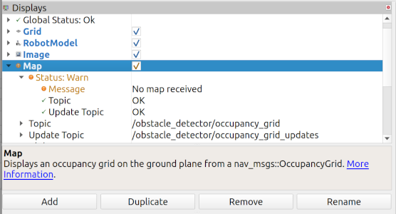
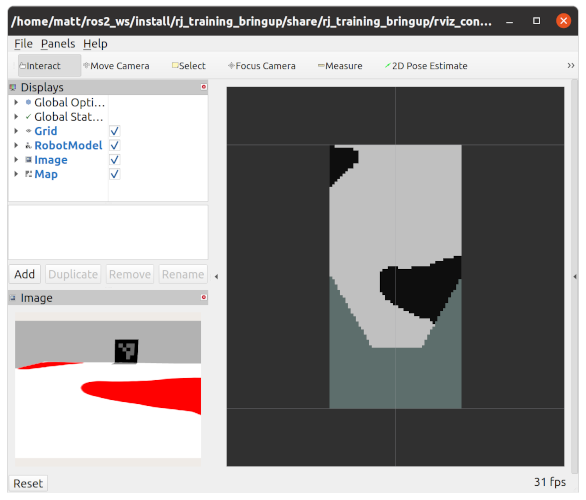

<!--
STOP
We strongly recommend viewing this file with a rendered markdown viewer. You can do this by:
 - Opening this file in the GitHub web viewer
 - Pressing Ctrl+Shift+V in Visual Studio Code
 - Opening this file in any other markdown viewer you prefer
-->

# Week 2 Project: Coordinate Frame Transformations

<!-- START doctoc generated TOC please keep comment here to allow auto update -->
<!-- DON'T EDIT THIS SECTION, INSTEAD RE-RUN doctoc TO UPDATE -->
## Contents

- [1 Background](#1-background)
- [2 Running this project](#2-running-this-project)
- [3 Instructions](#3-instructions)

<!-- END doctoc generated TOC please keep comment here to allow auto update -->

## 1 Background

Color detection and homography are very common tasks for any robot that uses a camera to follow (or avoid) markings on the floor. In this project, we're going to make our robot aware of the "rocks" in our challenge mission, represented by red blobs on the challenge mat. You'll be implementing functions to isolate the red color in the image and use homography to reproject the camera's image into a top-down map for the robot.

## 2 Running this project

You can run this week's project using the week 2 launch file. This will startup the simulator, rviz, and your obstacle detection code.

```bash
$ ros2 launch rj_training_bringup week_2.launch.xml
```

To move the robot around and test your code at different positions, use the same joystick or keyboard control launch files as you used in week 1.

If you run it now, you'll see rviz complain that no messages are being published on our occupancy grid topic.



Once you've got your code working, you should see a map show up in rviz's 3D viewport. The black areas are marked obstacles and should match the shape of the red rocks on the challenge mat. The white areas are free of obstacles. The grey area is the part of the reprojected image that we had no original pixel data for, so the robot doesn't know what's in that area.



## 3 Instructions

