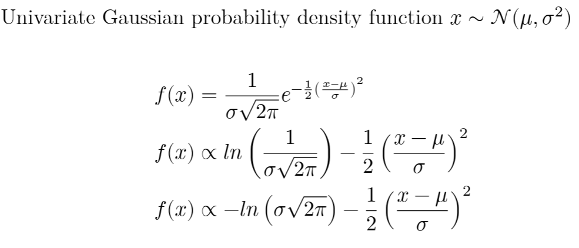
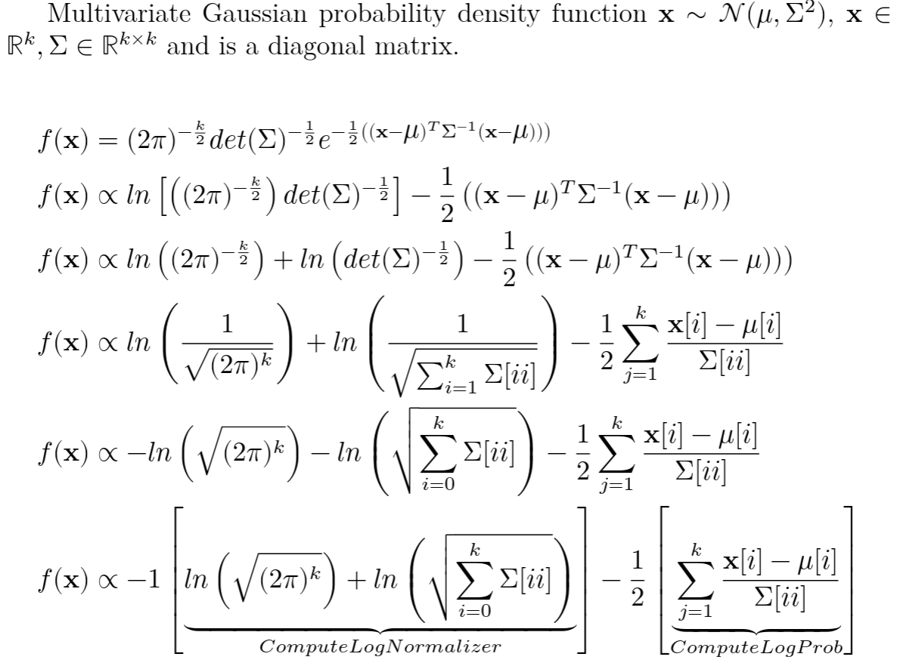
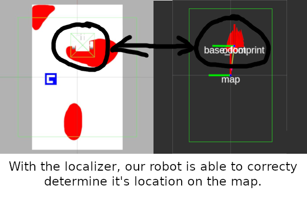
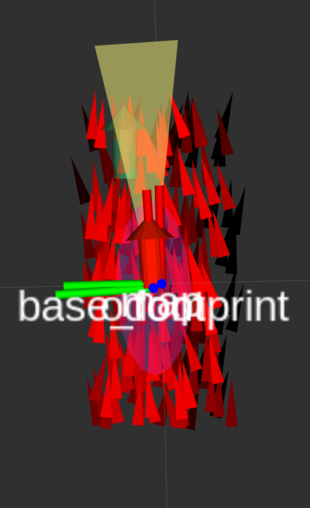

<!--
STOP
We strongly recommend viewing this file with a rendered markdown viewer. You can do this by:
 - Opening this file in the GitHub web viewer
 - Pressing Ctrl+Shift+V in Visual Studio Code
 - Opening this file in any other markdown viewer you prefer
-->

# Week 3 Project: Particle Filter Localization

<!-- START doctoc generated TOC please keep comment here to allow auto update -->
<!-- DON'T EDIT THIS SECTION, INSTEAD RE-RUN doctoc TO UPDATE -->
## Contents

- [1 Background](#1-background)
- [2 Running this project](#2-running-this-project)
- [3 Instructions](#3-instructions)
  - [3.1 Get the latest starter code](#31-get-the-latest-starter-code)
  - [3.2 Inspect SensorModel interface](#32-inspect-sensormodel-interface)
  - [3.3 Declare sensor model class](#33-declare-sensor-model-class)
  - [3.4 Setup implementation file](#34-setup-implementation-file)
  - [3.5 Get parameter values](#35-get-parameter-values)
  - [3.6 Setup subscription](#36-setup-subscription)
  - [3.7 Implement IsMeasurementAvailable](#37-implement-ismeasurementavailable)
  - [3.8 Implement ComputeLogProb](#38-implement-computelogprob)
  - [3.9 Implement ComputeLogNormalizer](#39-implement-computelognormalizer)
  - [3.10 Add sensor model to vector of models](#310-add-sensor-model-to-vector-of-models)
  - [3.11 Add parameter file to launch file](#311-add-parameter-file-to-launch-file)
  - [3.12 Replace fake localizer in week 3 launch file](#312-replace-fake-localizer-in-week-3-launch-file)
  - [3.13 Tune your particle filter](#313-tune-your-particle-filter)
  - [3.14 Commit your new code in git](#314-commit-your-new-code-in-git)

<!-- END doctoc generated TOC please keep comment here to allow auto update -->

## 1 Background

In this project, we'll be implementing a particle filter for localization. Our robot will use this particle filter to figure out where it is in the world. Even when we have direct measurements on our state variables, sch as GPS satellites, there is always uncertainty associated with any measurement we get. Sometimes we can get a reasonable estimate using only a single source of information, but algorithms like the particle filter let us combine multiple sources of information to get an even more accurate estimate of our actual location. This approach is often called sensor fusion or filtering and can be generally applied to any robotics problem. Here we will focus on finding position of the robot in world frame.

Our particle filter will incorporate three sources of information:

1. ArUco tag sightings

   Our robot can determine the relative transform (in body frame) to an aruco tag from its camera. Using the known locations of each tag, we can get an estimate of where our robot should be given that sensor reading. This is done by comparing the distance and heading from the particle to the tag on a map with the measured distance and heading from the tag detection. the Problem is simplified since each tag has a unique ID represented by the pattern of squares.  These measurements are susceptible to noise in the camera image and small errors in tag detection.

1. Odometry measurements

   Our robot has encoders connected to its motors, so we can measure how fast our wheels are actually turning. Our system reports these measurements back to us as body velocities for the robot (forward velocity, and yaw rate). We can use this to weight our particles by how closely they match the real motion of our robot.

1. Motion commands

   The motion commands we send to the robot, via our teleoperation nodes (or autonomous navigation code in the future), are also useful for our particle filter. These commands can act as our motion model, telling our particle filter how we expect our robot to move (with some uncertainty, of course). Often your motion model will end up being another sensor, like an IMU, rather a command, but in simpler systems this can work.

We'll be implemeneting the odometry sensor model and adding it to the list of models our particle fitler considers.

To demonstrate our localizer this week, we'll be running your robot through the "[kidnapped robot problem](https://en.wikipedia.org/wiki/Kidnapped_robot_problem)." This involves putting our robot in a random location and making it figure out where it is on its own. Particle filters are pretty good at solving this problem if the environment around the robot is useful, since they can keep track of multiple possible locations for the robot at the same time. Other filtering techniques cannot do this easily.

### Log Probability

In our particle filter implementation we will be computing the log probability as we discussed in the videos. Why are we computing the _log_ of the probability instead of just returning the probability? Well, these probabilities are likely to be very small (close to zero). There are practical limits to the kinds of numbers we can represent with a computer, and really small numbers are hard to work with accurately. Taking the log of a really small number tends to give us a more reasonable number. For example, log(0.00001) is about -11.5. This keeps the numbers we pass around in a more comfortable range for the computer.

But we could do that shift in any number of ways, why log specifically? That's because logs can turn multiplication into addition. When we want to multiply two probabilities, we can just add their logs. When we want to divide, just subtract the logs. Addition and subtraction are usually a lot faster than multiplication and division, so this better representation also gives us faster code!

Also remember that since we are only trying to find the most probable particle we just need to find something proportional to the probability rather than the full value. The following figure shows a full derivation starting from the PDF of a univariate (scalar) and a multivariate (vector). We are using the multivariate version. The math below is just using log rules to move things around and properties of diagonal matrices which we have not covered explicitly, so don't worry about it if you cannot follow it. If you are interested in that property look at the result of a x^T a I x, where x, x^T are the same vector, a is a scalar, and I is the identity matrix. Remember that A[ii] would be the ith row and ith column of a matrix.





## 2 Running this project

You'll need to run two commands to start this week's project. The first is the week 3 launch file that starts up the simulator, rviz, and your localization code.

```bash
$ ros2 launch rj_training_bringup week_3.launch.xml
```

The second is any command for controlling the robot. You can use either the joystick control launch file or the keyboard control launch file, depending on if you'll be using your keyboard or joystick to control the robot.

```bash
$ ros2 run stsl_utils keyboard_teleop
or
$ ros2 launch traini_bringup joystick_control.launch.py
```

In rviz, you'll see the boundary of the map and three coordinate frames. The "base_footprint" frame shows the robot's current estimate of where it is. The transformation from "odom" to "base_footprint" is tracked by our odometry system, using encoders. The robot will always start at <0,0> in the "odom" frame. The robot should move smoothly relative to the odom frame, but its absolute position will gradually build up error. In the "map" frame, we care more about absolute position than smooth trajectories, so the robot's position in the "map" frame is allowed to jump around. The conventions for these frame names are specified in [REP 105](https://www.ros.org/reps/rep-0105.html). The localization code we're writing this week will be publishing the "map" -> "odom" frame. This is a corrective transformation that accounts for the error built up in the "odom" frame. If our code works, the total transform through "map" -> "odom" -> "base_footprint" will give us the correct location for the robot.

This week, when you start up the simulator, you're robot will be moved to a random location on the map. In the starter code, we're running a fake localizer node that always puts the "map" and "odom" frames in the same place. This effectively only uses the encoder measurements for localization. If you run the project with this fake localizer, you should see the robot is not showing up in the same place in rviz and in Gazebo. You can see the difference in the robot's predicted position and true postiion by seeing the divergence of the two odometry topics (colored arrows). The red arrow is where the robot predicts itself to be, and the green arrow is the true location.


If you drive the robot around, you'll see both displays show the same relative robot motion, but the rviz display is always off by some amount because it thought the robot started in a different place than it actually did.

Once you get your localization code working, the "base_footprint" frame should converge onto the robot's real location. Also the red and green arrows should align. You'll also see a new cloud of triangles show up around the robot. These are the particles from your particle filter. Their location shows you the pose estimate associated with each particle, and their brightness represents their probabilistic weight. Bright particles are weighted higher, and dark particles have lower weights. The brightness of particles are relative to each other, therefore if you see a lot of bright particles that are in the wrong spot that means your filter has diverged and all particles have similar low weights.

It may take a few seconds for your robot's estimate of its position to converge to the correct spot. The particles start randomly distributed across the whole map, and it'll take them a few iterations to settle on the right answer. The distribution we are using to initialize the particles is a [uniform distribution](https://en.wikipedia.org/wiki/Continuous_uniform_distribution), this will evenly distribute the initial particles around the map. Going back to our problem definition, it makes sense that our robot could be anywhere on the map. If we had a strong initial guess or prior about our robot we could incorporate that into our initialization.



## 3 Instructions

### 3.1 Get the latest starter code

To make sure you're starting with the latest starter code, pull from the git server in your copy of the software-training repository.

```bash
$ cd training_ws/src/software-training
$ git pull
```

You'll also want to make sure you've got the latest version of the training support library by running an apt package update.

```bash
$ sudo apt update
$ sudo apt upgrade
```

If you have done a different installation of stsl that is not through apt make sure to pull the latest code there.

### 3.2 Inspect SensorModel interface

This week, we'll be writing code in the [localization](../../localization) package.

We're going to be creating a new class, `OdometrySensorModel`, that acts as a sensor model for our particle filter. All sensor models need to inherit from the `SensorModel` class, which defines the common interface for sensor models. Let's start by taking a look at [sensor_model.hpp](../../localization/src/sensor_model.hpp) and understanding our interface.

`SensorModel` declares three functions we're expected to implement:

1. ComputeLogProb

   This function computes the probability of a given particle being our true location based on the model's current measurement. It takes in the particle, and returns the log of the exponential section of the Gaussian probability density function.

1. ComputeLogNormalizer

   This function computes the normalizer for our sensor model probabilities. This method will handle the parts of the Gaussian distribution's probability density function that only depend on the dimensionality (size) of our sensor output vector.

1. IsMeasurementAvailable

   This function checks if this model has an up-to-date measurement available to be applied to the particle weighting process.

Notice the parameters for these functions are all constant references. This tells us that these functions only need to read values from the objects and won't be modifying them. Also, all three functions are pure virtual functions, so there is no default implementation for our model class to use. We must provide our own implementation for these functions.

In addition to these three functions, `SensorModel` also gives every model class two member variables, `covariance_` and `timeout_`, for storing the values of common model parameters.

Now that we understand the interface our new sensor model will have to implement, let's start writing some code.

### 3.3 Declare sensor model class

The first step to creating our new sensor model class is to add the two files we'll use to write our class. Go to [the src folder for the localization package](../../localization/src) and add two new files "odometry_sensor_model.hpp" and "odometry_sensor_model.cpp".

We'll need to add our new implementation file to the package's build rule. Open localization's [CMakeLists.txt](../../localization/CMakeLists.txt) and find the student code comment block in the call to `add_library`. Add "odometry_sensor_model.cpp" to the list of files given to the `add_library` function.

Back in [odometry_sensor_model.hpp](../../localization/src/odometry_sensor_model.hpp), we'll start by adding header guards.

```C++
#ifndef ODOMETRY_SENSOR_MODEL_HPP_
#define ODOMETRY_SENSOR_MODEL_HPP_

// The rest of our code for this file will go here

#endif  // ODOMETRY_SENSOR_MODEL_HPP_
```

Next, we'll need to include three headers. One includes our `SensorModel` header, and the other two pull in ROS resources.

```C++
#include <rclcpp/rclcpp.hpp>
#include <nav_msgs/msg/odometry.hpp>
#include "sensor_model.hpp"
```

All of our localization code lives in the `localization` namespace, so we'll need to do the same for this class.

```C++
namespace localization
{
// Class declaration will go here
}  // namespace localization
```

And now, we can declare our class, `OdometrySensorModel`. Make sure it inherits from `SensorModel`.

<details>
<summary><b>Hint:</b> How to declare a derived class.</summary>
<p>To declare a class A that inherits from class B, we'd write this:</p>
<pre><code>class A : public B {
};</code></pre>
</details>

Our class will need two member variables (in addition to the ones it's inheriting). Add declarations for these member variables with `private` access.

```C++
nav_msgs::msg::Odometry last_msg_;
rclcpp::Subscription<nav_msgs::msg::Odometry>::SharedPtr odom_sub_;
```

Next, let's declare the member functions for our new class. All of the functions for this class should be declared with `public` access since they are called externally.

First up, our constructor. Declare a constructor for `OdometrySensorModel` that takes a reference to an `rclcpp::Node`, called `node`.

Then, the function we'll use as our subscription callback for new odometry messages:

```C++
void UpdateMeasurement(const nav_msgs::msg::Odometry::SharedPtr msg);
```

And finally, declare the overrides for the three functions required by the `SensorModel` interface. A quick way to do this is to copy the function declarations from `SensorModel`, replace the "`= 0;`" bits with "`override;`", and remove the `virtual` keyword from the start of each.

That's the entire declaration for our new sensor model class. Now we just need to implement those functions.

### 3.4 Setup implementation file

Open up [odometry_sensor_model.cpp](../../localization/src/odometry_sensor_model.cpp). For this file, we'll need to include three header files.

```C++
#include "odometry_sensor_model.hpp"
#include <cmath>
#include <vector>
```

Note that the header file that corresponds to this implementation file always gets included first when writing in the implementation file. The `<vector>` header gives us `std::vector`, and `<cmath>` gives us a variety of math constants and functions, such as pi and trigonometry functions.

This file should use the same namespace as the header file. Add a namespace block so we can put our function definitions in the `localization` namespace.

Finally, stub out an empty definition for the `OdometrySensorModel` constructor. Remember that when we're defining member functions in an implementation file, we need to prefix the function name with the class name and two colons.

```C++
OdometrySensorModel::OdometrySensorModel(rclcpp::Node & node)
{
}
```

### 3.5 Get parameter values

In the `OdometrySensorModel` constructor, let's start by grabbing the values of the ROS parameters we'll be using in this model. The two parameters we'll need are "sensors/odom/covariance" and "sensors/odom/measurement_timeout".

Remember, to declare a ROS parameter (and get its value at the same time), we use the `declare_parameter` function. We need to template it for the type of data we want, give it the full name of the parameter, and give it a default value incase that parameter isn't given at run time. For our covariance parameter, that would look like this:

```C++
covariance_ = node.declare_parameter<std::vector<double>>("sensors.odom.covariance", {0.1, 0.1});
```

We're storing the parameter value into the `covariance_` member variable. The type of the data we want is `std::vector<double>`. The parameter name is `"sensors.odom.covariance"`, and the default value is an array of two doubles.

Note that `declare_parameter` is a member function of `rclcpp::Node`, so we're calling it on the node object given to the constructor. Our sensor model class is not, itself, a ROS node, so we use a node reference to interact with ROS resources.

Following the example above, declare the "sensors/odom/measurement_timeout" parameter. It's type should be `double` and its default value should be `0.1`. Store the value you get in the `timeout_` member variable.

### 3.6 Setup subscription

Our new sensor model will be using `nav_msgs::msg::Odometry` messages from the "/odom" topic, so we need to setup a subscription to that topic. In the `OdometrySensorModel` constructor, after the calls to `declare_parameter`, initialize `odom_sub_` with a call to `create_subscription`. This function will also need to be called on `node`.

For the quality of service (qos) parameter, use `rclcpp::SystemDefaultsQoS()`.

For the callback, use `std::bind` to pass in the `OdometrySensorModel::UpdateMeasurement` function.

That's all the code we'll need for our constructor. After the constructor, add the definition for `UpdateMeasurement`. All this function is going to do is store the incoming message into the `last_msg_` member variable.

```C++
void OdometrySensorModel::UpdateMeasurement(const nav_msgs::msg::Odometry::SharedPtr msg)
{
  last_msg_ = *msg;
}
```

Note the asterisk in the assignment line. `msg` is a pointer! Specifically, it's a `std::shared_ptr`. We're dereferencing the pointer to copy the values from the incoming message into `last_msg_`.

If you didn't recognize that `mgs` is a shared pointer, don't worry. It looks a little different than the usual `std::shared_ptr`. Some libraries, like rclcpp, offer type aliases for shared pointers to the class type as an internal type named `SharedPtr`. All this means is that these two types are just different names for the same type:

```C++
nav_msgs::msg::Odometry::SharedPtr
std::shared_ptr<nav_msgs::msg::Odometry>
```

With that taken care of, our subscription is now ready and our sensor model is prepared to get odometry messages from the robot.

### 3.7 Implement IsMeasurementAvailable

Next, let's add the definition for `IsMeasurementAvailable`. This function will check the timestamp of `last_msg_` to see how old our data is. If the data is older than `timeout_` seconds, this function should return `false`, because our data is too old to be useful. Otherwise, it'll return true.

To begin, create an empty definition. Note that we don't need the `override` keyword in implementation files.

```C++
bool OdometrySensorModel::IsMeasurementAvailable(const rclcpp::Time & current_time)
{
}
```

The first step in this function is to check if we've gotten any message at all. One quick way to check this is to look at the seconds part of the message's header timestamp. If this is zero, the message object was default-initialized, so we haven't gotten a message yet.

```C++
if(last_msg_.header.stamp.sec == 0)
  return false;
```

After that, calculate the time since the last message was received. We can do this by subtracting the message time from `current_time`. To make this work, we need to convert the message time into an `rclcpp::Time` object.

```C++
const auto time_since_last_msg = current_time - rclcpp::Time(last_msg_.header.stamp);
```

And finally, return the result of comparing the number of seconds represented by `time_since_last_msg` against our `timeout_` variable.

```C++
return time_since_last_msg.seconds() < timeout_;
```

### 3.8 Implement ComputeLogProb

Add the definition for `ComputeLogProb`. (If you're not sure how, check out what we did for `IsMeasurementAvailable`).

This function is going to compute the log of the exponential of the probability that the given particle is our true location given the latest odometry measurements, from now on we will just say log probability. You can check the background section at the front if you want a refresher on log probability. It'll do this by comparing the particle's x and yaw velocities against the real x and yaw velocities reported in the odometry message. Remember both of these measurements and values in the filter are in body frame.

To calculate the log probability we need here, we're going to divide the square error of each velocity by the covariance for that measurement. Then we'll add the two log probabilities together to get the total probability of the particle's state. This matches exactly with the log of the exponential part of the Gaussian PDF. The negative and 0.5 is added elsewhere in the code.


```C++
double log_prob = 0.0;
log_prob += pow(last_msg_.twist.twist.linear.x - particle.x_vel, 2) / covariance_[0];
log_prob += pow(last_msg_.twist.twist.angular.z - particle.yaw_vel, 2) / covariance_[1];
return log_prob;
```

### 3.9 Implement ComputeLogNormalizer

Our other important and mathy function is `ComputeLogNormalizer`. This function computes the normalizer value that every probability estimate is divided by, this is the nonexponential part of the Gaussian PDF. (In this case, both our probability and normalizer are log'ed so we can use subtraction). This value doesn't depend on a specific particle, just the covariance we're using for the measurement.

Add the definition for `ComputeLogNormalizer` to our implementation file.

And here's the body of the function:

```C++
return log(sqrt(pow(2 * M_PI, 2))) +
       log(sqrt(covariance_[0])) + log(sqrt(covariance_[1]));
```

The negative is added in a different section of the code.

### 3.10 Add sensor model to vector of models

Our new sensor model is now completely implemented. All we need to do now to start using it is add it to the list of models our particle filter considers.

Open up [particle_filter_localizer.cpp](../../localization/src/particle_filter_localizer.cpp). This is the actual ROS node class for our localizer node.

We're going to use our new class type in this file, so we need to start by including the header for our class. Find the student code comment block among the include statements at the top of the file. Add an include for odometry_sensor_model.hpp.

`ParticleFilterLocalizer` keeps a list of sensor models in a `std::vector` named `sensor_models_`. Right now, that just has an instance of `ArucoSensorModel` in it. When the particle filter node updates the particle weights, it loops through all of the sensor models in this vector and factors in each probability. All we need to do to throw our new sensor model into the mix is add it to this vector.

To do this, find the student code block near line 70. You should see this line:

```C++
sensor_models_.push_back(std::make_unique<ArucoSensorModel>(*this));
```

Add a line to the student code block that appends a new `OdometrySensorModel` instance to `sensor_models_`. You'll need to duplicate the line above and change the templated type of `make_unique`.

While we're here, notice the use of `this`. We've mentioned before that `this` is a special pointer that points to the current instance of the class this function is a part of. Here, we're dereferencing `this` so we can pass a reference to the current object to the constructor of `OdometrySensorModel`.

Another neat thing about this line is there are two uses of polymorphism happening. First, we're managing heap objects of multiple types through a container of `unique_ptr`s to the base type. Second, we're passing a reference to a `ParticleFilterLocalizer` to a function (the constructor) expecting a reference to an `rclcpp::Node`. This works because `ParticleFilterLocalizer` inherits from `rclcpp::Node`.

Before continuing past this section, make sure your code compiles successfully (using `colcon build`). We're done writing C++ code for this project, so this is a good time to catch any mistakes we may have made along the way.

### 3.11 Add parameter file to launch file

Now we're going to switch gears and make some changes to the launch files for this project.

Open up [particle_filter_localizer.launch.py](../../localization/launch/particle_filter_localizer.launch.py) in the launch folder of the localization package. This is a python launch file that runs and configures our particle filter node. Like all python launch files, we've got the `generate_launch_description` function that returns a `LaunchDescription` object to describe the launch actions we'd like to take. In this case, we're just starting a single node, `localization_node`.

Our localizer uses many parameters, so we've collected them into [localizer_params.yaml](../../localization/config/localizer_params.yaml) in the config folder of the localization package. Notice how the path structure of our parameter names has mapped to the structure of our yaml file. "sensors/odom/covariance" has become:

```yaml
sensors:
  odom:
    covariance: 0.05
```

This is similar to other uses of namespace structures in ROS, and lets us organize our parameters into meaningful groups.

Unfortunately, at the moment, our fancy parameter file isn't being used. We need to make some edits to our launch file.

First, we need to get the path to the launch file. Find the student code comment block at the top of the `generate_launch_description` function. Create a variable named `parameters_file_path` to hold our file path and initialize it using `os.path.join` and `get_package_share_directory`.

```Python
parameters_file_path = os.path.join(get_package_share_directory(
    'localization'), 'config', 'localizer_params.yaml')
```

`get_package_share_directory` gives us the full path to the directory holding shared installation resources for the given package (localization, in this case). When you're building the package from source, this path will be in the install directory of your colcon workspace. When the package was installed from binaries, this path will be in `/opt/ros/VERSION/share`.

`os.path.join` is a Python utility for joining multiple path components. We're using it to extend the share path we get with the relative path to the parameter file, `config/localizer_params.yaml`.

Next, we need to give this path to the `Node` action. Find the other student code comment block in the launch file. Within this block, add a new argument for the `Node` action, named `parameters`. We need to pass this argument a list of parameter sources. The first one will be the path we just found, `parameters_file_path`. The second should be a dictionary object that forwards the launch argument named `use_sim_time` to a node parameter of the same name.

```Python
parameters=[
    parameters_file_path,
    {'use_sim_time': LaunchConfiguration('use_sim_time', default='false')}
],
```

Now our launch file actually loads the parameter file and sends all of our configured values to the node.

### 3.12 Replace fake localizer in week 3 launch file

There's one more launch file we need to edit. Right now, the top-level launch file for the week 3 project starts a fake localizer. We need to replace it with our new particle filter localizer.

Open [week_3.launch.xml](../../rj_training_bringup/launch/week_3.launch.xml) in the launch folder of the rj_training_bringup package. Find the student code block surrounding the include tag for fake_localizer.launch.py. Edit this tag to make it include our particle filter launch file instead. You'll need to change the package name to "localization" and the launch file name to "particle_filter_localizer.launch.py".

Ok. Now, the week 3 launch file will run with the real particle filter localization node. You should now be able to run the project and see the particle cloud and better location estimate in rviz.

### 3.13 Familiarizing yourself with the particle filter

Here we will be changing parameters in the config file that you connected to your launch file ([localizer_params.yaml](../../localization/config/localizer_params.yaml)). For this section pay close attention to your mass of particles rather than the state estimate coming out. Often it is easier to tune based on a vague idea of the particles rather than the estimate coming out.

The first thing you should do is run the project but no teleoperation node. That should look like this,



Here you can see the particles where they initialize (the filter is disabled until we start giving control commands). This is a great tool for debugging, since you can selectively turn on and off things using the parameters and see their effect without motion jitter. You should see that the particle filter estimate is relatively near the ground truth arrow, but will likely have a small offset. Don't worry about that for now, just take a quick look at your particles and make sure things look reasonable (like the image). If not you likely have a bug in your code somewhere.

The purple circle around the red arrow represents the positional uncertainty of the particle filter estimate. The yellow cone represents the yaw uncertainty of the output. When running the filter these two should be relatively small, and if the true position ever goes outside the purple, that indicates your filter is poorly tuned.

Now that we have working code, let's try getting an intuition for what the covariance parameters do. We'll go through a couple changes to see what they do.

1. Set the parameter everything in "sensors/aruco/covariance" to a very large number like 10000.0 (don't forget the .0 part). Given what we know of particle filter what do you expect to happen? Make sure you run `colcon build` when changing parameters to make sure your parameters change.

    <details>
    <summary><b>Hint:</b> Large Covariance For Aruco</summary>
    <p>A large covariance means we do not trust the sensor, therefore we will mostly focus on the odometry sensor model you wrote. Since that does not have a direct measurement on position, you should see the particles average out to about the center of their mass. This is because each particle has similar weight without trust the aruco detection sensor.</p>
    </details>

1. Set the second value of the aruco covariance back to 0.1. This controls the part of the aruco marker sensor model that is comparing the distance to the tag, what do you expect the particles to look like?

    <details>
    <summary><b>Hint:</b> No Distance Measurement</summary>
    <p>Here we expect to see that particle that are aligned with the markers we see, but at bad distance estimates. This is really a constraint on yaw. Look for low probability particles with incorrect yaw.</p>
    </details>

1. Set the aruco covariance to (0.03, 10000.0). This controls the part of the sensor model that looks at distance to the tag. Which particle do you think are most likely with this tuning?

    <details>
    <summary><b>Hint:</b> No Angular Measurement</summary>
    <p>Here we expect to see that particle that are the correct distance, but could have the wrong yaw. </p>
    </details>


### 3.14 Tuning Your particle filter

Now that we have a feel for what the different tuning parameters can do, let's try and tune our particle filter. Below is the general approach to tuning a particle filter. The most important thing is to carefully think through what the parameter change should do theoretically and compare that to what you see. Some tuning might affect the stopped particle filter, and some might only be noticible with motion. To get the particles to move all you need to do is run either teleop node.

1. Number of particles:

    a. The first thing we are going to tune is the number of particles. Let's start with a very small number of particles. Try setting the number of particles in the config file to 10 particles and run the filter. This should not work well and likely diverge. Why does this occur?
    <details>
    <summary><b>Hint:</b> Too Few Particles</summary>
    <p>With too few particles there is a good chance none of them are good. The filter will choose the best particle, which could lead us in a very bad direction. Furthermore, a random sampling of noise in the motion model can make the particle move in the wrong direction. If we don't have any particles that move in the right direction, there is a good change we will diverge.</p>
    </details>

    b. Increase the number of particles to be a very large number (like 1000 or 10000), what do you see?
    <details>
    <summary><b>Hint:</b> Too Many Particles</summary>
    <p>The filter should be relatively accurate at first but be very slow to keep up with the movement of the robot. You have too many particles here, remember the computation time of the filter scales linearly with the number of particles.</p>
    </details>

    c. Now slowly increase the number of particles in increments of 50 (50, 100, 150, 200, etc) until you think the filter is converging well. How many particles do you think we need?
1. Motion model tuning

    a. Now that we have a reasonable number of particles (around 200 worked for us) let's try playing around the noise injected into the motion model. Play around with the values for the motion model, look for the motion_sigmas in the config file. This is the amount of noise added to each channel of the motion. We sample the noise from a zero mean Gaussian with unit variance (1) then multiply it by this value. Try setting the amount of noise added to x, y, yaw to be 0. What happens with your filter? Why do you think these are useful for convergence?

    <details>
    <summary><b>Hint:</b> Low Motion Noise</summary>
    <p>You should see that by removing those noises our filter has a hard time converging to the right values. This is due to adding additional noise in x,y allows our filter to shift to align with the sensor reading easier without being constrained by the actual motion.</p>
    </details>

    c. Now increase the motion sigmas on x, y, yaw to a very large number (like 0.5), What do you see and why is this occurring?
    <details>
    <summary><b>Hint:</b> High Motion Noise</summary>
    <p>the filter will then have a hard time remaining converged. Often when tuning particle filters you want to ensure that your noise is small enough to encourage convergence but not too large to result in jumpy behavior. This is a tuning thing that will depend a lot on the current application.</p>
    </details>
1. Odometry sensor model tuning

    a. Try setting the measurement covariance very small for the odometry measurement (like 0.001), what do you see and why is this occu4ring?
    <details>
    <summary><b>Hint:</b> Low Covariance </summary>
    <p>You should see that the particle filter has a harder time converging to the correct values since particle with a small amount of motion have a low probability. Since our motion model is injecting noise it is very unlikely that a particle will have close to the correct velocity estimate.</p>
    </details>

    b. Try setting the measurement covariance very high (like 0.5), what do you see and why is this occurring?

    <details>
    <summary><b>Hint:</b> High Covariance </summary>
    <p>You should see the filter work well, but be a little less stable when you are not moving. The odometry sensor model is mostly used for stationary positions but as long as you can see an aruco marker the position should be relatively stable due to that sensor reading alone.</p>
    </details>


This was a short introduction to the ideas of tuning a particle filter. We encourage you to play around with all of the parameters.

### 3.15 Commit your new code in git

Once you've got your code for this project working, use the command below to commit it into git. This will make it easier to grab changes to the starter code for the remaining projects.

```bash
$ git commit -a -m "My project 3 code."
```
