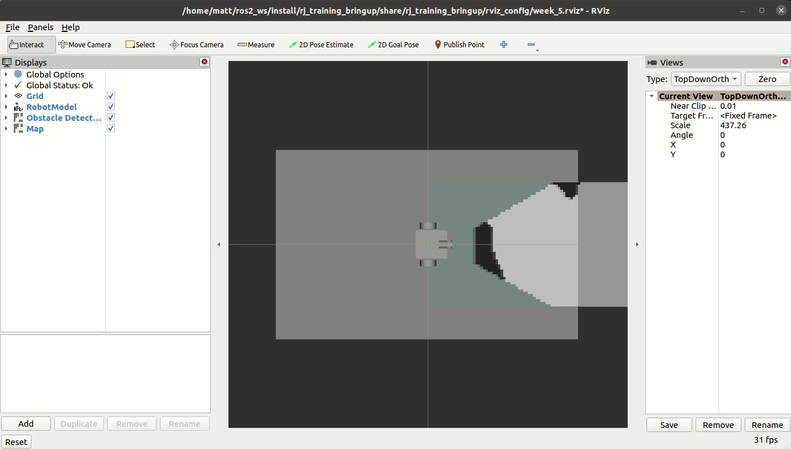

<!--
STOP
We strongly recommend viewing this file with a rendered markdown viewer. You can do this by:
 - Opening this file in the GitHub web viewer
 - Pressing Ctrl+Shift+V in Visual Studio Code
 - Opening this file in any other markdown viewer you prefer
-->

# Week 5 Project: Mapping

<!-- START doctoc generated TOC please keep comment here to allow auto update -->
<!-- DON'T EDIT THIS SECTION, INSTEAD RE-RUN doctoc TO UPDATE -->
## Contents

- [1 Background](#1-background)
  - [1.1 The Algorithm](#11-the-algorithm)
  - [1.2 The Code](#12-the-code)
- [2 Running this project](#2-running-this-project)
- [3 Instructions](#3-instructions)
  - [3.1 Get the latest starter code](#31-get-the-latest-starter-code)
  - [3.2 Setup TF Listener](#32-setup-tf-listener)
  - [3.3 Check if transforms are available](#33-check-if-transforms-are-available)
  - [3.4 Implement GetRobotLocation()](#34-implement-getrobotlocation)
  - [3.5 Implement UpdateProbability()](#35-implement-updateprobability)
  - [3.6 Implement AddObstaclesToMap(): Iterate over obstacle cells](#36-implement-addobstaclestomap-iterate-over-obstacle-cells)
  - [3.7 Implement AddOsbtaclesToMap(): Update map with obstacle cell data](#37-implement-addosbtaclestomap-update-map-with-obstacle-cell-data)
  - [3.8 Initialize obstacles_subscription_](#38-initialize-obstacles_subscription_)
  - [3.9 Commit your new code in git](#39-commit-your-new-code-in-git)

<!-- END doctoc generated TOC please keep comment here to allow auto update -->

## 1 Background

This week, we'll be implementing an algorithm for mapping our robot's environment. In Project 2, you used computer vision techniques to identify obstacles near our robot. These obstacles are the read shapes on our floor mat, which represent rocks our robot can't drive over. As things stand now, our robot only knows about the obstacles it can see at any given moment. It has no ability to keep track of all the obstacles it has seen so far. Our mapping node will take in these individual frames of obstacle detections and combine them into a complete map of the world.

Note that this project depends on you having working solutions for projects 1, 2, and 3.

### 1.1 The Algorithm

The approach we'll be using for mapping is known as [occupancy grid mapping](https://en.wikipedia.org/wiki/Occupancy_grid_mapping). We layout a grid of cells across the entire mappable area, where each cell holds the probability that the space is occupied by an obstacle. By assuming that neighboring cells don't influence each other, we can treat all of these probabilities as independant. This lets us have simple update equations that only work with the data for a single cell.

As usual, because of the realities of representing small fractional numbers in computers, we'll be using the log-odds representation of our probabilities in our map. If you read through the starter code, you'll see two helper functions, `fromLogOdds` and `toLogOdds`, which convert between log-odds and direct probability representations. Ultimately, our node will publish a `nav_msgs::msg::OccupancyGrid` message that expects integral probability values between 0 and 100.

### 1.2 The Code

All of the code we'll be writing in this project will be in the [mapping package](../../mapping). Specifically, we'll be completing the implementation of [mapping_node.cpp](../../mapping/src/mapping_node.cpp).

This node uses two sources of input. The first is a `nav_msgs::msg::OccupancyGrid` topic that contains the obstacle detections published by our obstacle detector. This occupancy grid is associated with the robot's coordinate frame, so it moves around the world as the robot moves.

The second input source is the TF system. While TF uses topics under the hood, we don't have to deal with them directly. Instead, we'll use TF's listener API to get the specific transforms we'll be interested in. Our node will use this to convert robot-relative obstacle coordinates into world-relative map coordinates, and to get our robot's current position in the world.

The mapping node publishes one topic: a `nav_msgs::msg::OccupancyGrid` topic that contains the global map built by our node. This occupancy grid is associated with the "map" coordinate frame, so it stays fixed to the world.

## 2 Running this project

To run this week's project, you'll need to run two things: the project launch file and a teleop source.

The project launch file will start the simulator, rviz, and processing nodes.

```bash
$ ros2 launch rj_training_bringup week_5.launch.xml
```

For the teleop source, you can use either keyboard teleop or joystick teleop.

```bash
$ ros2 run stsl_utils keyboard_teleop
or
$ ros2 launch traini_bringup joystick_control.launch.py
```

In rviz, you should see the robot, the obstacle detections (similar to Project 2), and the map being published by the mapping node. As you drive your robot around, you'll see the map get updated with the obstacles seen at that location. After a bit of exploring, your map should be complete, showing all of the red obstacles present on the floor mat.



**Note:** Your pose estimate from the particle filter may be pretty noisy. This can sometimes make debugging the mapper difficult, since it assumes the pose estimate is correct. You can launch the project launch file this week with an optional argument that will switch to using the "fake localizer". This localizer is much smoother than your particle filter, but it can't correct for odometry errors as they build up. It should be very accurate for a bit, and then gradually the pose estimate will get worse. This should be enough to help you debug the mapping node.

```bash
$ ros2 launch rj_training_bringup week_5.launch.xml use_fake_localizer:=True
```

## 3 Instructions

### 3.1 Get the latest starter code

To make sure you're starting with the latest starter code, pull from the git server in your copy of the software-training repository.

```bash
$ cd training_ws/src/software-training
$ git pull
```

You'll also want to make sure you've got the latest version of the training support library by running an apt package update.

```bash
$ sudo apt update
$ sudo apt upgrade
```

If you have done a different installation of stsl that is not through apt make sure to pull the latest code there.

### 3.2 Setup TF Listener

Since we'll be using data from the TF system in this node, we'll need to start by setting up our TF buffer and listener. First step, include the needed headers. The first, `transform_listener.h` provides the core TF utilities. `tf2_geometry_msgs.h` gives us specializations of the TF functions for the message types in the geometry_msgs package. Add these includes in the student code block among the other includes at the top of [mapping_node.cpp](../../mapping/src/mapping_node.cpp).

```C++
#include <tf2_ros/transform_listener.h>
#include <tf2_geometry_msgs/tf2_geometry_msgs.h>
```

Next, add two new member variables to hold our TF buffer and listener. These will go in the student code block with the other member variables of our class, just after the `private` access specifier.

```C++
tf2_ros::Buffer tf_buffer_;
tf2_ros::TransformListener tf_listener_;
```

Finally, we need to initialize these variables. Find the student code block surrounding the class's member initializer list in the constructor. Add initializers for our new member variables. `Buffer`'s constructor takes a clock, which we can get with the `get_clock()` function. `TransformListener`'s constructor takes the buffer object.

```C++
  explicit MappingNode(const rclcpp::NodeOptions & options)
    // BEGIN STUDENT CODE
  : rclcpp::Node("mapping_node", options),
    tf_buffer_(get_clock()),
    tf_listener_(tf_buffer_)
    // END STUDENT CODE
{...
```

### 3.3 Check if transforms are available

Whenever we use transform data from TF, it's best to check early that all of the frames and transforms we're going to need are actually available. This lets us handle any errors in a controlled way more easily than having to catch exceptions at every call to a TF function. Find the student code comment block at the start of the `ObstaclesCallback` function. This is where we'll add our check.

The function we'll use is `canTransform`. Given a source frame, a target frame, and a timestamp, this function returns true if all of the TF data needed for that transform is available. There are two transforms we'll need:
- map frame -> robot frame
- camera frame -> map frame

The camera frame is just the frame id given to us in the obstacle message's header. The other two frame IDs will come from parameters. Because we just want the latest transform data for these frames, not at a specific time, we can give `tf2::TimePointZero` as the timestamp to `canTransform`. This is a special constant that basically means "give me the latest available information".

If either of our transforms isn't available, we'll print log a message indicating that we're waiting for TF data, and return from the callback, skipping the rest of our code.

```C++
if (!tf_buffer_.canTransform(robot_frame_id_, map_frame_id_, tf2::TimePointZero) ||
    !tf_buffer_.canTransform(obstacles_msg->header.frame_id, map_frame_id_, tf2::TimePointZero))
{
  RCLCPP_INFO_ONCE(get_logger(), "Waiting for necessary TF data to be available.");
  return;
}
```

### 3.4 Implement GetRobotLocation()

Now that we've done all of our setup and error checking, it's time to actually get a transform! Find the `GetRobotLocation` function. This function is responsible for checking TF to get our robot's current location in the map frame. To do this, we'll use the TF buffer's `lookupTransform` function. We need to give it a source frame and a target frame, and this is where things can get a little confusing.

When looking up a pose via `lookupTransform`, it sometimes feel like your source and target frames are backwards. The thing to remember is that the transforms we get back from TF are always the transform needed to convert a location in the source frame to the same location relative to the target frame. If we want to get the transform that tells us the pose of frame A relative to frame B, we need to use frame B as the source and frame A as the target.

<!-- TODO give an example to explain this better -->

So, to get our robot's pose relative to the map frame, we need to lookup the transform from the robot frame to the map frame. Call `lookupTransform` on `tf_buffer_`. Use `map_frame_id_` as the target frame, `robot_frame_id_` as the source frame, and `tf2::TimePointZero` as the timestamp. Save the result in a constant variable named `robot_transform`.

Now that we have the transform, we just need to copy the x and y values into a `Point` object and return it.

```C++
geometry_msgs::msg::Point robot_location;
robot_location.x = robot_transform.transform.translation.x;
robot_location.y = robot_transform.transform.translation.y;
return robot_location;
```

### 3.5 Implement UpdateProbability()

Find the `UpdateProbability` function. This function updates an individual cell in our map based on an obstacle measurement. We'll be using the update equation for probabilistic mapping covered in the videos.

`UpdateProbability` takes in three parameters:
- `robot_location` is the location of our robot, in the map frame
- `map_location` is the location of the obstacle measurement, in the map frame
- `obstacle_detected` is `true` if there was an obstacle at that point and false otherwise

The first step is to convert our obstacle location from meters to an index into our `map_data_` container. We can use the map origin and resolution to convert the location into cell coordinates, and then use the `MapDataIndexFromLocation` helper function to convert those cell coordinates into an index.

```C++
const int cell_x = (map_location.x - map_info_.origin.position.x) / map_info_.resolution;
const int cell_y = (map_location.y - map_info_.origin.position.y) / map_info_.resolution;
const auto data_index = MapDataIndexFromLocation(cell_x, cell_y);
```

Our probability update equation will use the distance between our robot and measurement locations. To get the distance between two points, we can take the square root of the sum of the squares of difference in each dimension. This is an application of the [Pythagorean Theorem](https://en.wikipedia.org/wiki/Pythagorean_theorem) you're probably already familiar with. In C++, we have a function that gives us the squareroot of the sum of squares of its arguments: [std::hypot](https://en.cppreference.com/w/cpp/numeric/math/hypot) (short for "hypotenuse"). So, calculating the distance between our two locations can be done like this:

```C++
const auto distance_robot_to_measurement = std::hypot(
  robot_location.x - map_location.x,
  robot_location.y - map_location.y);
```

Now we've got everything we need to update our map probability. 

<!-- TODO explain this math at least a little -->

```C++
auto probability = std::exp(-distance_coefficient_ * distance_robot_to_measurement);
probability *= (obstacle_detected ? hit_log_odds_ : miss_log_odds_);
map_data_[data_index] += probability;
map_data_[data_index] = std::clamp(map_data_[data_index], 0.0, 1.0);
```

### 3.6 Implement AddObstaclesToMap(): Iterate over obstacle cells

We've got one more function to implement: `AddObstaclesToMap`. This function takes in the `OccupancyGrid` message containing our obstacle measurements, and uses each cell in the grid to update our map data. The general structure will look like this:

1. Iterate over each cell in `obstacles`. Skip any cells with "unknown space" values.
1. Convert the cell location in the obstacles grid to a location in meters in the map frame.
1. Check that this map location is within our map bounds. Skip any cells that aren't.
1. Call `UpdateProbability` to update the map data at this location.

In this section, we'll implement step 1. 

Find the student code comment block in `AddObstaclesToMap`. Here, we need to create two, nested for loops. The outer loop should iterate through y values from `0` to `obstacles.info.height - 1`. The inner loop should iterate through x values from `0` to `obstacles.info.width - 1`.

In the body of the inner loop, the first thing we need to do is calculate the index into the `OccupancyGrid`'s data array from our cell location. This data array is in "row-major order". This is a method of flattening 2-dimensional data into a 1-dimensional container. In row-major order, we concatenate all of the rows of our 2D data into one long array. As we traverse the 1D array, we'll see all of the elements from the first row, then all of the elements from the second row, and so on. To get an index into the 1D array from our x and y cell coordinates, we first get the starting index of our row by multiplying our y coordinate by the 2D width, then add our x coordinate as an offset into that row.

```C++
const auto obstacle_data_index = x + (y * obstacles.info.width);
```

Now that we have that index, we can get the measurement data at that location.

```C++
const auto obstacle_data = obstacles.data.at(obstacle_data_index);
```

Remember back to Project 2, when we wrote the obstacle detector. There are areas of the `OccupancyGrid` that the camera can't see. Thus, each cell in our grid contains one of three values:

- 0: Free space with no obstacles
- 100: A cell that is covered by an obstacle
- -1: A cell that is unknown, because we couldn't measure that spot

We want to skip all of the unknown cells, since they don't give us any information we can use to update the map. To do this, we just need to check if our obstacle data is -1, and if it is, continue to the next iteration of our loop.

```C++
if (obstacle_data == -1) {
  continue;
}
```

Now we've got our loops setup to iterate over every cell that gives us useful information.

### 3.7 Implement AddOsbtaclesToMap(): Update map with obstacle cell data

Continuing where we left off in the previous section, we now want to transform our cell location in the obstacle grid into a location in the map frame, in meters. First, let's convert our cell coordinates into meters in the obstacle grid's frame. This involves multiplying our cell coordinates by the grid's resolution (in meters per cell) and adding the offset of the grid's origin.

```C++
geometry_msgs::msg::PointStamped obstacle_location;
obstacle_location.header.frame_id = obstacles.header.frame_id;
obstacle_location.point.x = (x * obstacles.info.resolution) +
  obstacles.info.origin.position.x;
obstacle_location.point.y = (y * obstacles.info.resolution) +
  obstacles.info.origin.position.y;
```

We save these values into a `PointStamped` object with the frame ID set so we can use it with the TF library.

To transform this location from the obstacle frame to the map frame, we can use our TF buffer's `transform` function. This function takes a piece of stamped data (data that includes a frame_id and timestamp) and transforms the data into the give target frame. So, we just need to give it `obstacle_location` as the data, and `map_frame_id_` as the target frame.

```C++
const auto map_location = tf_buffer_.transform(obstacle_location, map_frame_id_);
```

Now that we have the location of the measurement in the map frame, we can check if this location is actually within the bounds of our map. Any points that are outside of these bounds should be skipped.

```C++
if (!IsLocationInMapBounds(map_location.point)) {
  continue;
}
```

Finally, we have all of the data we need to update this location in our map, and we're confident that it is a valid map location. Call `UpdateProbability` to do the actual update, with the code we wrote earlier.

```C++
UpdateProbability(robot_location, map_location.point, obstacle_data == 100);
```

And that's all we need for this function. We've now written all the code needed to take in a new frame of obstacle detections and update our map considering these detections.

### 3.8 Initialize obstacles_subscription_

There's one more thing we need to do to get this code to work: initialize our obstacle detections subscription. Find the student code comment block at the end of our node's constructor.

Here, call `create_subscription` to initialize `obstacles_subscription_`. The type of the messages is `nav_msgs::msg::OccupancyGrid`. The topic name should be `"~/obstacles"`, and the quality of service should be set to `rclcpp::SystemDefaultsQoS()`.

We're going to set the callback to our `ObstaclesCallback` function, but instead of using `std::bind` as we have before, let's use a lambda. Using captures, lambdas can do the same things that `std::bind` does, in terms of grouping a member function with the instance it should be called on. In this case, we just need to write a lambda that captures `this` and forwards one argument to `ObstaclesCallback`.

```C++
[this](const nav_msgs::msg::OccupancyGrid::SharedPtr msg) {ObstaclesCallback(msg);}
```

This lambda does the same thing as we could do with `std::bind`:
```C++
std::bind(&MappingNode::ObstaclesCallback, this, std::placeholders::_1)
```

Whether you choose to use lambdas or `std::bind` is usually just a matter of style choice. Some projects will prefer one over the other in certain circumstances. Of course, `std::bind` can only do a subset of the things lambdas can do, so there will be some instances where `std::bind` isn't the right tool.

That's all the code we need to write to get this project going. You should now be able to test your new mapping node with the instructions in up in section 2.

### 3.9 Commit your new code in git

Once you've got your code for this project working, use the command below to commit it into git. This will make it easier to grab changes to the starter code for the remaining projects.

```bash
$ git commit -a -m "My project 5 code."
```
