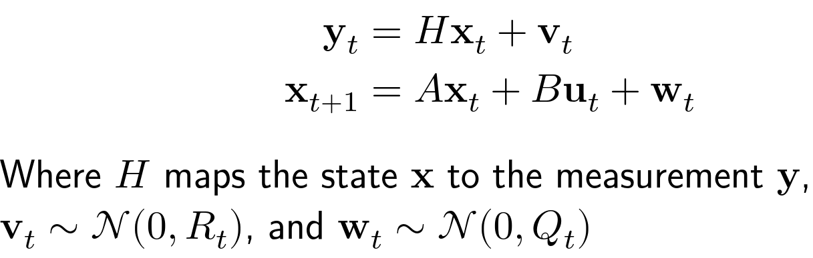
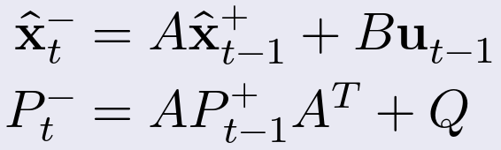
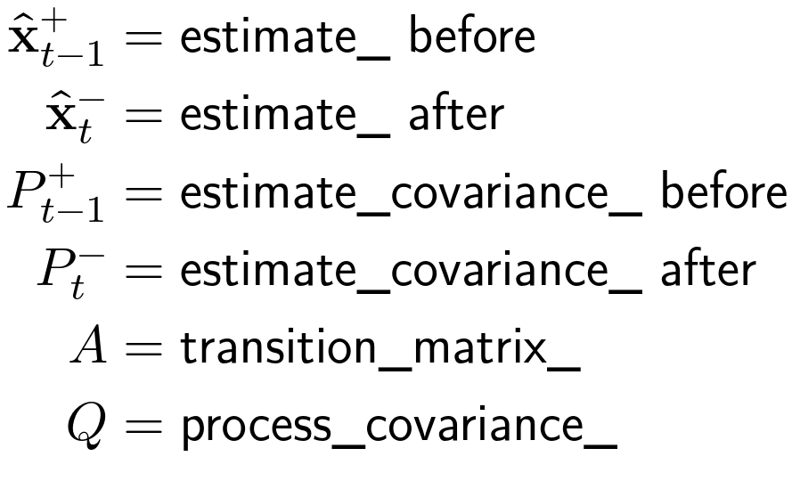
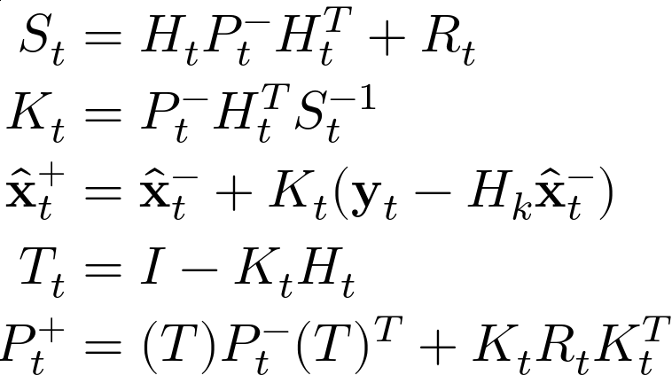

<!--
STOP
We strongly recommend viewing this file with a rendered markdown viewer. You can do this by:
 - Opening this file in the GitHub web viewer
 - Pressing Ctrl+Shift+V in Visual Studio Code
 - Opening this file in any other markdown viewer you prefer
-->

# Week 6 Project: Kalman Filter

<!-- START doctoc generated TOC please keep comment here to allow auto update -->
<!-- DON'T EDIT THIS SECTION, INSTEAD RE-RUN doctoc TO UPDATE -->
## Contents

- [1 Background](#1-background)
  - [1.1 The Code](#11-the-code)
- [2 Running this project](#2-running-this-project)
- [3 Instructions](#3-instructions)
  - [3.1 Get the latest starter code](#31-get-the-latest-starter-code)
  - [3.2 Setup Kalman filter class](#32-setup-kalman-filter-class)
  - [3.3 Add nested types](#33-add-nested-types)
  - [3.4 Add member variables](#34-add-member-variables)
  - [3.5 Add KalmanFilter constructor](#35-add-kalmanfilter-constructor)
  - [3.6 Add Reset function](#36-add-reset-function)
  - [3.7 Add TimeUpdate function](#37-add-timeupdate-function)
  - [3.8 Add MeasurementUpdate function](#38-add-measurementupdate-function)
  - [3.9 Commit your new code in git](#39-commit-your-new-code-in-git)

<!-- END doctoc generated TOC please keep comment here to allow auto update -->

## 1 Background

In this project, we'll be writing a Kalman filter to track the mineral deposits in our challenge world. The filter will let our robot get a more accurate estimate of the deposits location from a series of noisy measurements.

In our final challenge for this semester, our robot will be given a list of estimated mineral deposit locations. These are only rough estimates, but we can detect the deposits with a sensor on board the robot. (This sensor is simulated using the blue ArUco tags on the floor mat, with added noise.) The robot will need to navigate to each deposit and "sample" it (which is represented by the robot blinking its signal LED).

If we blindly follow our initial estimates or raw sensor measurements, we're likely to miss the deposit. Instead, we'll use the given estimate as the initial state for our Kalman filter and run all of the sensor measurements through the filter. The position estimate we get back from the filter will be more accurate than our raw measurements, and will greatly increase our chances of landing on the deposit.

### 1.1 The Code

For this project, we'll be writing code in the [mineral_deposit_tracking](../../mineral_deposit_tracking) package. The mineral_deposit_tracker node in this package takes in the raw sensor readings, tracks a single deposit by ID, and publishes the estimated position. Here are the interfaces for this node:

* ~/sensed_deposits (Subscription)
  * Type: stsl_interfaces/msg/MineralDepositArray
  * Raw sensor readings of deposits that our robot can see. Each message contains an array of detections, where each detection contains the ID, range, and heading of the detected deposit.
* ~/tracked_deposit_publisher (Publisher)
  * Type: goemetry_msgs/msg/PoseStamped
  * The filtered position estimate of the currently tracked deposit.
* ~/reset (Service server)
  * Type: stsl_interfaces/srv/ResetMineralDepositTracking
  * This service resets the internal filter, sets the deposit ID to track, and provides the initial estimate for the new deposit.

Specifically, you'll be adding a new header file to this package which defines a templatized `KalmanFilter` class, and editing [mineral_deposit_tracker.cpp](../../mineral_deposit_tracking/mineral_deposit_tracker.cpp) to use your new filter.

The sensor readings are coming from the `mineral_deposit_detector` node installed with the STSL packages. That node will subscribe to the ArUco tag detections and publish stsl_interfaces/msg/MineralDepositArray messages. Each deposit detection is derived by adding some Gaussian noise to an ArUco tag detection. The mineral deposit ID is actually the ID of the underlying ArUco tag.

The `mission_orchestrator` node, from the `mission_orchestration` package in STSL, is the node that actually iterates over the list of initial estimates, calls the reset service on the tracking node, and consumes the pose estimates published by the tracking node. This node uses a [behavior tree](https://en.wikipedia.org/wiki/Behavior_tree_(artificial_intelligence,_robotics_and_control)) to control the robot's high-level behavior and decision making. This includes triggering navigation and blinking the signaling LED. You shouldn't need to understand the code in this package to complete this project, but for those curious about how such a node is made, you can find the [mission_orchestration source](https://github.com/RoboJackets/stsl/tree/main/mission_orchestration) in the STSL repository.

## 2 Running this project

To run this week's project, you'll need to run one launch file:

```bash
$ ros2 launch rj_training_bringup week_6.launch.xml
```

As usual, this launch file will startup the simulator, rviz, and all of the other nodes the project requires.

By default, this will use the particle filter localizer node you worked on in project 3. You can optionally use the fake localizer with the `use_fake_localizer` argument.

```bash
$ ros2 launch rj_training_bringup week_6.launch.xml use_fake_localizer:=true
```

In rviz, you should see a panel that includes an "Execute Mission" button. This button starts a test mission that just navigates to each deposit (using your filter) and blinks the signaling LED.

In the rviz viewport, you'll see the floor mat and the robot. When the robot starts tracking a deposit, the estimated location of that deposit will show up as a 3D axis (red, green, and blue lines). The estimated location will only update while the blue tag for that deposit is in the field of view of the robot's camera. You can see which ArUco tags are seen by looking at the "Tag Detection Image" panel.

With the starter code, you robot will follow the raw sensor readings, so you'll probably see the deposit location in rviz jump around a lot. Once you've finished adding your Kalman filter, the deposit location will still move around, but it should be smoother, and it should generally trend towards the true center of the deposit tag.

Here's what it looks like with everything working:


Note that the fake localizer is still susceptible to odometry noise, which can impact the accuracy of our deposit tracking (since our measurements come in relative to the robot's pose).

## 3 Instructions

### 3.1 Get the latest starter code

To make sure you're starting with the latest starter code, pull from the git server in your copy of the software-training repository.

```bash
$ cd training_ws/src/software-training
$ git pull
```

You'll also want to make sure you've got the latest version of the training support library by running an apt package update.

```bash
$ sudo apt update
$ sudo apt upgrade
```

If you have done a different installation of stsl that is not through apt make sure to pull the latest code there.

### 3.2 Setup Kalman filter class

We'll be writing a new, templatized class for our Kalman filter, called `KalmanFilter`. To start, create a new header file for this class, called `kalman_filter.hpp` in the [mineral_deposit_tracking src folder](../../mineral_deposit_tracking/src).

Note that, since we're writing a templated class, we'll be writing all of our code in this header file. There won't be a `kalman_filter.cpp` file. All function declarations in the `KalmanFilter` class will also be function definitions.

In this new header file, add header guards (`#ifndef`,`#define`, `#endif`).

Then, include `<Eigen/Dense>`.

Finally, open the `mineral_deposit_tracking` namespace, and add a new class named `KalmanFilter`. This class should be templated with one non-type template parameter: an `int` named `StateSize`. This template parameter will hold the number of dimensions to the state vector tracked by our Kalman filter. To use our Kalman filter to track a 3D state, we would create a `KalmanFilter<3>`.

<details>
<summary><b>Hint:</b> Here's what the header should look like now.</summary>
<pre><code>#ifndef KALMAN_FILTER_HPP_
#define KALMAN_FILTER_HPP_

#include <Eigen/Dense>

namespace mineral_deposit_tracking
{

template<int StateSize>
class KalmanFilter
{
public:

private:

};

}  // namespace mineral_deposit_tracking

#endif  // KALMAN_FILTER_HPP_
</code></pre>
</details>

### 3.3 Add nested types

Types, like classes and structs, are allowed to declare nested types within themselves. These types often appear in our code within the "namespace" of the outer class type. (Note this is a conceptual namespace, but not a literal `namespace`.) One popular way to use nested types is to use a "using-declaration" to give a convenient alias for an existing type or template specialization that we'll use frequently in the class.

A using-declaration looks like this:

```C++
using NewTypeName = ExistingTypeName;
```

These declarations create a new type that is just an alias for another existing type in our code. If we had the using-declaration above, we could create a variable of type `NewTypeName`, and this would actually end up creating an `ExistingTypeName` variable.

You'll sometimes see the same type aliasing done with the `typedef` keyword, which is why this practice is sometimes referred to as "typedef-ing". Using-declarations are generally preferred over `typedef` in new code, since the new `using` syntax works better with templated types than `typedef` does.

In our case, we're going to be using a lot of vectors and matrices from the Eigen library. The size of these vectors and matrices is determined by our `StateSize` template parameter. For convenience, we're going to declare new vector and matrix types of the correct size once, and then every other part of our class can use these convenience type names.

At the start of our class's public access section, declare two new type aliases: `VectorType` and `MatrixType` using `StateSize`.

```C++
using VectorType = Eigen::Matrix<double, StateSize, 1>;
using MatrixType = Eigen::Matrix<double, StateSize, StateSize>;
```

Now, the rest of our class's code can use `VectorType` and `MatrixType` to get the appropriately sized Eigen type.

### 3.4 Add member variables

Our `KalmanFilter` class will need to hold five private member variables. Three are constant matrices used by the filter math, the other two are the tracked state and its covariance.

```C++
const MatrixType transition_matrix_;
const MatrixType process_covariance_;
const MatrixType observation_matrix_;
VectorType estimate_;
MatrixType estimate_covariance_;
```


* `transition_matrix_`

   holds the matrix that describes how the state estimate changes with each time step of the filter. This represents our motion equation. We are assuming that our B matrix is zero, therefore there is no control to consider. Furthermore for this example our tag location will not move so we can also set the A matrix to the identity. That means our next location is the previous location with respect to the motion update.

* `process_covariance_`

   holds the covariance associated with the step change represented by `transition_matrix_`. This matrix represents the Q matrix we talked about in the lecture. That is the covariance matrix of the stochastic noise of the dynamics (w).

* `observation_matrix_`

   maps our measurement vectors to state vectors. This is the H matrix we talked about in the lecture.

* `estimate_`

   is the current state estimate calculated by our filter. In this case this will represent the posteriori estimate of our position, we include the most recent measurement.

* `estimate_covariance_`

   is the covariance of the current state estimate. This is the posteriori estimate of the covariance, we include the current measurement.

We want the estimate and estimate covariance to be accesible (in a read-only manner) by other objects, so we need to add some "getter functions." These functions just return a constant reference to the corresponding member variable. They should both be declared with public access.

```C++
const VectorType & GetEstimate() const
{
  return estimate_;
}

const MatrixType & GetEstimateCovariance() const
{
  return estimate_covariance_;
}
```

Note that the functions are declared as constant functions (with the `const` keyword at the end of the signature) since they don't modify the contents of the class.

Now, users of our class can get the current estimate and covariance by calling `GetEstimate()` and `GetEstimateCovariance()`.

### 3.5 Add KalmanFilter constructor

Add a constructor to `KalmanFilter`. This constructor should take in values for the three constant matrices and use those values to intiailize the constant member variables.

`estimate_` should be initialized as a zero vector, using `VectorType::Zero()`.

`estimate_covariance_` should be initialized as a diagonal matrix with all diagonal values being 500. We can do this by multiplying the identity matrix (`MatrixType::Identity`) by 500.

<details>
<summary><b>Hint:</b> Solution constructor</summary>
<pre><code>KalmanFilter(
  const MatrixType & transition_matrix,
  const MatrixType & process_covariance,
  const MatrixType & observation_matrix)
: transition_matrix_(transition_matrix),
  process_covariance_(process_covariance),
  observation_matrix_(observation_matrix),
  estimate_(VectorType::Zero()),
  estimate_covariance_(MatrixType::Identity() * 500)
{
}
</pre></code>
</details>

### 3.6 Add Reset function

Add a new function to `KalmanFilter`, called `Reset`.

This function should return `void`.

It should take two parameters:

* A constant reference to a `VectorType` called `initial_state`
* A constant reference to a `MatrixType` called `initial_covariance`

The body of this function should just assign the parameter values to `estimate_` and `estimate_covariance_` respectively.

### 3.7 Add TimeUpdate function

Add a new function to `KalmanFilter` named `TimeUpdate`. This function takes no parameters and returns `void`.

`TimeUpdate` will implement the "time update" or "predict step" of the kalman filter. Because our transition matrix and process covariance are constants, this function doesn't need any external inputs (thus, no parameters).

In the body of this function, implement the predict step equations to update our estimate and estimate covariance.




### 3.8 Add MeasurementUpdate function

Add a new function to `KalmanFilter` called `MeasurementUpdate`. This function should return `void` and take two parameters:
* A constant reference to a `VectorType` called `measurement`
* A constant reference to a `MatrixType` called `measurement_covariance`

`MeasurementUpdate` will implement the "measurement update" or "correct step" of the Kalman filter. In addition to the measurement and measurement covariance from the parameters, this function will make use of our observation matrix (`observation_matrix_`).




The first of these two images show you a broken down way of computing the kalman measurement update. The second image gives mapping to know values and recommended naming for the structures listed in the equations image.

We recommend following the steps listed in the equation and each equals sign should be a line.

1. Calculate the innovation covariance.
2. Calculate the Kalman gain
3. Update the state estimate using steps 1 and 2
4. Compute an intermediate step for simplicity
5. Finally update the estimate covaraince

### 3.9 Add filter to tracking node

Now that our Kalman filter is implemented, we need to update our tracking node to actually use it. The code in this section will all be written in [mineral_deposit_tracker.cpp](../../mineral_deposit_tracking/src/mineral_deposit_tracker.cpp).

Start by including our kalman filter header. Look for the student code comment block at the top of the file and add the include statement.

Find the student code comment block with the private member variables in the `MineralDepositTracker` class. Add a new private member variable called `filter_` of type `KalmanFilter<2>`. We're tracking a state with 2 dimensions: the x and y coordinates of the mineral deposit (in the map frame).

Next, find the student code comment block surrounding the member initializer list in the constructor. Add an initialer for `fitler_`. This initializer will call the constructor we wrote in section 3.5. The transition matrix should be the Identity matrix. The process covariance should be a diagonal matrix with all values set to 1e-4. The observation matrix should also be the identity matrix, since we are directly observing the state we are tracking.

```C++
filter_(Eigen::Matrix2d::Identity(),
    Eigen::Matrix2d::Identity() * 1e-4, Eigen::Matrix2d::Identity())
```

In the `ResetCallback` function, we need to reset our filter with the new initial estimate and covariance. Find the student code comment block in this function and add a call to `filter_.Reset(...)` passing in `position` as the initial estimate and `covariance` as the initial covariance.

Finally, in the `DepositMeasurementCallback`, we need to call our two update functions. This function is called every time a new mineral deposit detection message is available.

Find the first student code comment block in this function. Add a call to `filter_.TimeUpdate()`. This will cause our time update to run once for every sensor message. Normally, we might call this function from a timer. In our case, our sensor measurements come in at a fixed rate, so we can rely on that to time our calls.

Now find the second student code comment block in the `DepositMeasurementCallback` function. It contains a call to `PublishEstimate`. Right now, that call just publishes the raw measurement. Add a call to `filter_.MeasurementUpdate(...)`. Our measurement is `position`, which is built from the x and y coordinates in the detection. The covariance should be set to `covariance`, which is set to a constant value further up in the code. It's normal for filters on sensor data to use constant estimates of a sensors covariance, since we often don't have strong empirical values or values specified in a data sheet.

Now that the measurement update's been run, change the call to `PublishEstimate` to publish the filter's estimate, which you can get by calling `filter_.GetEstimate()`.

### 3.10 Commit your new code in git

Once you've got your code for this project working, use the command below to commit it into git. This will make it easier to grab changes to the starter code for the remaining projects.

```bash
$ git commit -a -m "My project 6 code."
```
