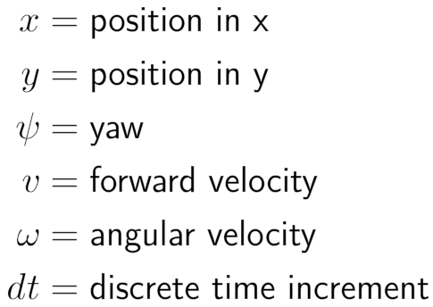
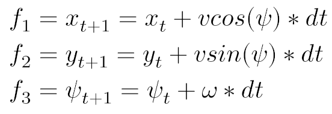
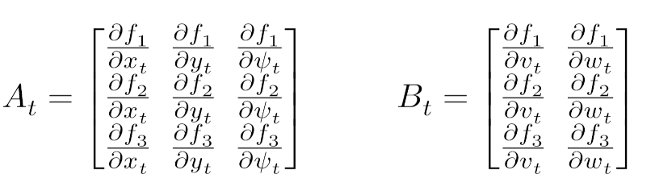
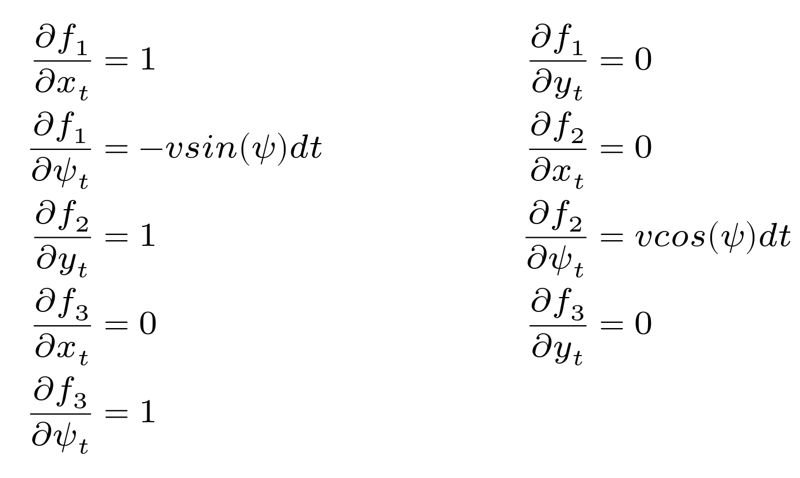
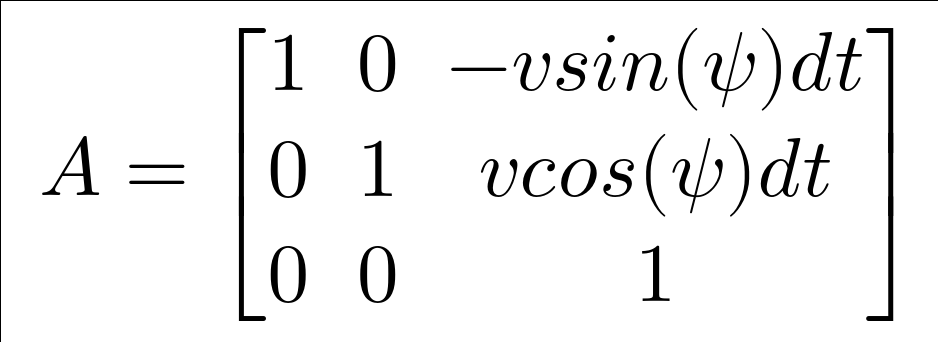
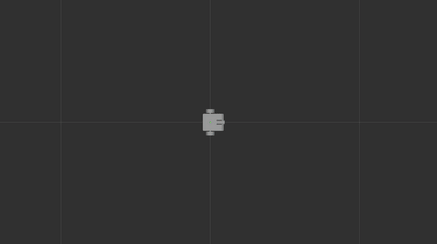

<!--
STOP
We strongly recommend viewing this file with a rendered markdown viewer. You can do this by:
 - Opening this file in the GitHub web viewer
 - Pressing Ctrl+Shift+V in Visual Studio Code
 - Opening this file in any other markdown viewer you prefer
-->

# Week 7 Project: Linear Quadratic Regulator

<!-- START doctoc generated TOC please keep comment here to allow auto update -->
<!-- DON'T EDIT THIS SECTION, INSTEAD RE-RUN doctoc TO UPDATE -->
## Contents

- [1 Background](#1-background)
  - [1.1 The navigation stack](#11-the-navigation-stack)
  - [1.2 The Code](#12-the-code)
- [2 Running this project](#2-running-this-project)
- [3 Creating the test action client](#3-creating-the-test-action-client)
  - [3.1 Get the latest starter code](#31-get-the-latest-starter-code)
  - [3.2 Creating the ControllerTestClient](#32-creating-the-controllertestclient)
  - [3.3 Adding ControllerTestClient to CMakeLists.txt](#33-adding-controllertestclient-to-cmakeliststxt)
  - [3.4 Setting up client interfaces](#34-setting-up-client-interfaces)
  - [3.5 Send the goal](#35-send-the-goal)
  - [3.6 Create goal response callback](#36-create-goal-response-callback)
  - [3.7 Feedback callback](#37-feedback-callback)
  - [3.8 Result callback](#38-result-callback)
  - [3.9 Calling actions](#39-calling-actions)
- [4 Implementing the LQR controller](#4-implementing-the-lqr-controller)
  - [4.1 The configure function](#41-the-configure-function)
  - [4.2 LQR controller dynamics](#42-lqr-controller-dynamics)
  - [4.3 Tuning the LQR controller](#43-tuning-the-lqr-controller)
  - [4.4 Commit your new code in git](#44-commit-your-new-code-in-git)

<!-- END doctoc generated TOC please keep comment here to allow auto update -->

## 1 Background

In this project we will be writing an implementation of both a PID controller and a Linear Quadratic Regulator controller.
To complete the final challenge of the semester our robot will need to use every project.
This week we will give our robot the ability to follow a trajectory, a very important part of navigation.
Next week you will learn how to generate a trajectory to track, but this week we will focus on tracking a static trajectory.
Often you will want to start of tracking a static trajectory when you implement a new controller to verify things are working well and to tune it.
This project will investigate the differences between the two controllers, but both controllers are capable of performing trajectory tracking.

### 1.1 PID Controller

The PID (Proportional Integral Derivative) controller was covered in the first video of week seven (TODO link).
The basic idea of a PID controller can be summarized by the equation below,

TODO PID

Here we see 
The constant K_P (the K with a subscript of p) is applied to the current error of the system. 
P gains are used to account for offsets in errors, if the error is large it will apply a large control, if the error is small it will apply a small control.
This is the main gain you should be tuning when using a PID controller.
The idea is to get a P gain such that you have decent convergence to your setpoint even if you have a little bit of overshooting.
This will make more sense later.

The constant K_D is applied to the derivative of the error.
Since our system is in discrete time we will use the finite difference between the previous error and the current error (difference divided by time).
This is the second gain you should be tuning when using a PID controller.
The idea is that the D gain is applied in the negative sign of the derivative of the error.
It should help will dampening (reducing) the oscillations you see from a high P gain.

Finally the K_I is applied to the integral of the error.
Since our system is discrete it will just be summation of the past errors.
Theoretically the integral should be able to take any value, but often this can lead to a failure case known as integral windup.
Essentially the integral gets so large the system becomes unstable. 
We will look at this more in depth later in the exercise, but the solution is to cap the amount of the integral can be.
Typically you will want a very small integral gain, and it should be there to solve steady state error.
Steady state error is typically the small amount of error you will expect when the system stops oscillating.

The important thing to note is that the PID controller is model free.
Model free means we do not need a concept of our dynamics (how the robot state changes over time).
PID is model free since we have no dynamics, PID only looks at the current instant with some history encoded into the integral term and derivative term.
This means our controller can tend to be very short sighted, meaning it will sometimes poorly setup for future actions.
You will see this behavior more once you get to tuning the controller.

### 1.2 LQR Controller

The second controller that we implemented for you is the LQR (Linear Quadratic Regulator) controller.
This uses a neat bit of theory (covered in the videos) to compute the optimal (best) controls possible to track a given trajectory.
Typically LQR is used over the entire horizon of the problem (from the start time until it thinks it reaches the goal), but that poses a problem if we don't know how long that should be.
Here we will run iLQR in an MPC (Model Predictive Control) fashion. 
This just means we will run it from the current time for a fixed time horizon (like 1 second) repeatedly.

To use an LQR controller, we need to derive the dynamics equations for our system.
We are using a nonlinear dynamics model in our LQR implementation which raises an issue.
We need to be able to write it as a system of linear equations for LQR to work, therefore we linearize around some previous control and state trajectory.
This takes the form of the A and B matrices used by the controller. 
Our controller class has two functions: `computeAMatrix` and `computeBMatrix` which we'll use to calculate these matrices. 

Let's start by deriving what our A and B matrices should look like. 
These matrices depend on our current state because the differential drive system is nonlinear. 

In this math, we'll be using these variables:



We can represent our system dynamcis with three equations, one for each dimension of our state vector: x, y, and heading.



To compute the A matrix, we need to take the partial derivatives of each equation with respect to each variable in our state vector. For the B matrix, we take the partials with respect to each element of the control vector. For example the first element of the A matrix is the partial of f_1 with respect to x.



<details>
<summary><b>Hint:</b> A Matrix Math Solution</summary>




</details>

<details>
<summary><b>Hint:</b> B Matrix Math Solution</summary>


</details>

Now that we have derived the dynamics equations of our LQR controller, we can use them with a standard path tracking error cost function to track a trajectory.
You will see some performance benefits from LQR since it is able to reason about the future of the trajectory it is tracking.
The myopic behavior of the PID controller should look sad in comparison once you get both running.

### 1.3 The navigation stack

[Nav2](https://navigation.ros.org/) is ROS 2 "navigation stack". This is a collection of nodes and tools for handling the different parts of navigation for an autonomous robot, including path planning, path following, and recovery. Nav2 uses a plugin-based system to allow other developers to customize certain parts of the navigation stack. The diagram below shows the overall architecture of the Nav2 stack and highlights which parts are customizable with plugins.


Each part of the Nav2 stack communicates with the other parts primarily through ROS actions. For example, the "Planner Server" hosts an action, called `/compute_path_to_pose`, which will plan the path from the robot's current location to the given pose. The "BT Navigator Server" can then call that action whenever a new path needs to be planned. The "BT Navigator Server" itself also hosts an action `/navigate_to_pose` that acts as the main entry point for the navigation stack for most other parts of our ROS system. Whenever some part of our ROS system wants the robot to move, it can send the destination pose to the `/navigate_to_pose` action, which will take care of the rest.

## 1.4 Tracking a trajectory

In this exercise we will use two different controllers to track a trajectory. 
They way this works is that we have all the nodes on the path that is visualized in rviz.
We take the time we receive the path at the start time and index into the path to get where the robot should be if it is moving from point to point in `time_between_states` (a parameter) seconds.
When the time is in between two states we do a linear interpolation of the setpoint. 
This gives us relatively smooth behavior with a variety of controllers and is quick to implement.

### 1.5 The Code

If this feels a bit overwhelming, don't worry. This is just to give a bit of context around the code we'll be writing this week. In this project, we're going to be implementing a controller plugin for the Nav2 stack. We've taken care of the Nav2 parts of the code in the starter code, and you'll just be filling out the math for the PID controller and parameters for LQR control algorithm.
You'll be implementing the PID controller in the `PIDController` class in [pid_controller.cpp](../../controllers/src/pid_controller.cpp) and the `LQRController` class in [lqr_controller.cpp](../../controllers/src/lqr_controller.cpp).

We'll also be writing a test client for our controller that uses one of the "internal" actions of the Nav2 stack, `/follow_path`. This is the action hosted by the "Controller Server", which computes the command velocities needed to drive the robot along the path provided in the action goal. This client will be a separate node, which you'll implement from scratch. The path our test client uses will be generated by the `TestPathGenerator` class found in [test_path_generator.cpp](../../controllers/src/test_path_generator.cpp). You shouldn't need to edit this file. It's there if you're curious about how we create the figure-eight test path.


## 2 Running this project

To run this week's project, you'll need to run one launch file:

```bash
$ ros2 launch rj_training_bringup week_7.launch.xml
```

As usual, this launch file will startup the simulator, rviz, and all of the other nodes the project requires.

In rviz you should just see the robot.
It will not move until you implement LQR or PID and the action client.

The second command that won't work until you implement your action client is
```bash
ros2 run controller pid_controller_test_client --ros-args -p use_sim_time:=True
```

This runs the action client and sets use_sim_time to true so that all nodes are using the same time source.

to run the LQR controller after you implement your action client use
```bash
ros2 run controller pid_controller_test_client --ros-args -p use_sim_time:=True
```

Once you've finished writing the code for this project, you should see the robot follow a figure eight pattern like this:



Your tracking performance will heavily vary depending on your tuning and what controller you are using.
Try to investigate multiple tunings and what the different controllers will tend to do.

## 3 Creating the test action client

### 3.1 Get the latest starter code

To make sure you're starting with the latest starter code, pull from the git server in your copy of the software-training repository.

```bash
$ cd training_ws/src/software-training
$ git pull
```

You'll also want to make sure you've got the latest version of the training support library by running an apt package update.

```bash
$ sudo apt update
$ sudo apt upgrade
```

If you have done a different installation of stsl that is not through apt make sure to pull the latest code there.

### 3.2 Creating the ControllerTestClient

Create a cpp file in the [lqr_control src folder](../../controllers/src) called ControllerTestClient.
In this file you should write a standard ROS node class and constructor.

<details>
<summary><b>Hint:</b> A standard ROS2 node general form</summary>

```c++
#include <rclcpp/rclcpp.hpp>
#include <rclcpp_components/register_node_macro.hpp>

namespace my_package
{

class MyNode : public rclcpp::Node
{
public:

explicit MyNode(const rclcpp::NodeOptions & options)
: rclcpp::Node("my_node", options)
{
}

}  // namespace my_package
RCLCPP_COMPONENTS_REGISTER_NODE(my_package::MyNode)
```
</details>

### 3.3 Adding ControllerTestClient to CMakeLists.txt
You will need to add a couple lines to the [CMakeLists.txt](../../controllers/CMakeLists.txt) to compile your new node.

The first change is to add your new class as a source to be compiled into the controller library. This is done by adding the cpp file you created to the add_library call.

```cmake
add_library(controllers SHARED
        # BEGIN STUDENT CODE
        src/controller_test_client.cpp
        # END STUDENT CODE
        src/lqr_controller.cpp
        src/pid_controller.cpp
        src/test_path_generator.cpp
        )
```

The second thing you will need to do is to register the node as a component. This is done with a function from the rclcpp_components package: `rclcpp_components_register_node`. (Review the week 2 ROS videos for more details about creating ROS 2 nodes in C++.)

```cmake
# BEGIN STUDENT CODE
rclcpp_components_register_node(
        pid_control
        PLUGIN "pid_control::ControllerTestClient"
        EXECUTABLE pid_controller_test_client
)
rclcpp_components_register_node(
        controllers
        PLUGIN "controllers::ControllerTestClient"
        EXECUTABLE lqr_controller_test_client
)
# END STUDENT CODE
```

You should be able to run `colcon build` as you normally do without error.

### 3.4 Setting up client interfaces

The next thing we need to do in your ControllerTestClient code is to create an action client that uses the [nav2_msgs/action/FollowPath](https://github.com/ros-planning/navigation2/blob/foxy-devel/nav2_msgs/action/FollowPath.action) action type.

For convenience, (and shorter code later on), let's create a type alias for our action type. This will let us use the short name, `FollowPath`, instead of the fully namespace-qualified name.

```c++
using FollowPath = nav2_msgs::action::FollowPath;
```

Next create a class member variable of type `rclcpp_action::Client<FollowPath>::SharedPtr` to store the client, named `client_`.
	
Then, initialize the client in the node's constructor with the `rclcpp_action::create_client` function.

<details>
<summary><b>Hint:</b> Solution</summary>

```c++
explicit ControllerTestClient(const rclcpp::NodeOptions & options)
: rclcpp::Node("controller_test_client", options)
{
client_ = rclcpp_action::create_client<FollowPath>(this, "follow_path");
}

private:
rclcpp_action::Client<FollowPath>::SharedPtr client_;
```
</details>

The other interface our test client node will use is a topic, on which it will publish the plan. This is just used for visualization in rviz. This topic will use [nav_msgs::msg::Path](https://docs.ros2.org/foxy/api/nav_msgs/msg/Path.html) messages. 

Add a new publisher to your node class. The message type should be `nav_msgs::msg::Path`. The topic name should be "/plan". For the QoS settings, use these:

```C++
rclcpp::QoS qos_profile{1};
qos_profile.transient_local();
```

Why "transient local"? Well, our client is only going to publish this message once, so any visualization tools we start after the path is published wouldn't get any message if used "volatile" durability. With "transient local" durability, our late-starting tools will still get the path message published before they started. While this isn't strictly necessary for the demo in this project to run, it's pretty handy when debugging things.

### 3.5 Send the goal

Our action client needs to send a goal to the "/follow_path" action without blocking the main ROS event loop. To do this, we'll wrap this step in a function and run it on another thread.

Create a function called `SendGoal` that takes no parameters and returns nothing. Implement this function so it follows these steps:

1. Wait for the "/follow_path" action server to be ready. Use a timeout duration of 10 seconds. If the wait timesout, print an error message and shutdown the node by calling `rclcpp::shutdown()`.

   To wait for an action to be ready, use the `wait_for_action_server()` function on the client:
   
   ```C++
   client_->wait_for_action_server(std::chrono::seconds(10))
   ```

1. Create the goal object. This will be a variable of type `FollowPath::Goal`. This type has one member, `path`. We can get a path from our `TestPathGenerator` class. Then we'll just need to set the frame ID and time stamp.

   ```C++
   FollowPath::Goal goal;
   goal.path = TestPathGenerator(20).BuildPath();
   goal.path.header.frame_id = "map";
   goal.path.header.stamp = now();
   ```

1. Publish the path to our visualization topic. You can do this by passing `goal.path` to the `publish()` function on the visualization topic publisher you created in the previous section.

You may have noticed we never actually sent the goal with the action client. We'll come back to finish this function in a bit.

For now, let's wrap up this section by calling our new `SendGoal()` function in another thread. Back in the constructor, start and detach from a thread for the `SendGoal()` function.

```c++
std::thread(&ControllerTestClient::SendGoal, this).detach();
```

### 3.6 Create goal response callback
Before we call our action we need to create the methods that will be used by the action to communicate back to our client.
All of these methods will just be printing out a message based on the feedback from the action server and in one case ending the node.

Create a new function called `GoalResponseCallback`. This checks if the action server accepts our target goal. This function should take in the type `std::shared_future<GoalHandle::SharedPtr>` and return nothing.

You'll need to define another type alias at the top of your class for the `GoalHandle` type.

```c++
using GoalHandle = rclcpp_action::ClientGoalHandle<FollowPath>;
```

If the goal is accepted the value in the future will be not null, otherwise it will be null.
You should use the ROS logger to print out if the server accepted or rejected the goal.

<details>
<summary><b>Hint: </b> Printing with ROS logs</summary>

Use the ROS logging macros provided by rclcpp. In this example, "INFO" is the log level. This could also be set to "DEBUG", "WARN", "ERROR", or "FATAL".

```c++
RCLCPP_INFO(get_logger(), "MESSAGE");
```
</details>

### 3.7 Feedback callback

The second callback we will have is the FeedbackCallback.
This is using another Nav2 plugin that is telling you the distance to the goal.
We are following a trajectory not trying to reach a specific goal, so this number can increase as we follow the path.
The target point is the last position in the trajectory we are tracking.

Write a method that has the following parameters,
`GoalHandle::SharedPtr,
const std::shared_ptr<const FollowPath::Feedback> feedback` and return nothing.
The `distance_to_goal` field in the feedback message will give you the current distance to the goal.
It is of type [`nav2_msgs::action::FollowPath`](https://github.com/ros-planning/navigation2/blob/main/nav2_msgs/action/FollowPath.action).
These fields are filled in by the Nav2 stack.
Print out the distance to the waypoint using the logger.

### 3.8 Result callback

The third callback is the result callback.
Write a method takes in a `const GoalHandle::WrappedResult & result` and returns nothing.
Remember this result has 4 different statuses.
1. `rclcpp_action::ResultCode::SUCCEEDED`
2. `rclcpp_action::ResultCode::ABORTED`
3. `rclcpp_action::ResultCode::CANCELLED`
4. `rclcpp_action::ResultCode::UNKNOWN`
Print out a message using the logger to indicate what result code was returned.
Simply printing out the "succeed" using the logger would be sufficient.
Finally shutdown the down using `rclcpp::shutdown()`.
We do this since once the result returns this client is no longer needed and can be shutdown.

### 3.9 Calling actions

In this section we will finish implementing the `SendGoal()` function by actually sending the goal with our client object.

First, create a variable of type `rclcpp_action::Client<FollowPath>::SendGoalOptions`. This gets passed along with our goal message to tell our client what callbacks it should use.

You'll need to set three member variables on this options object:
1. Set the `goal_response_callback` to the `GoalResponseCallback` method
2. Set the `feedback_callback` to the `FeedbackCallback` method
3. Set the `result_callback` to the `ResultsCallback` method
```

For each of these, you'll need to use `std::bind` to bind the callback to the current object. Remember that you'll need to use placeholders to pass function parameters through the bound function.

```C++
// Bind a member function with one parameter
std::bind(&CLASS_NAME::CALLBACK_NAME, this,std::placeholders::_1);
// Bind a member function with two parameters
std::bind(&CLASS_NAME::CALLBACK_NAME, this, std::placeholders::_1, std::placeholders::_2);
```

Finally, send the goal by calling `async_send_goal` on the client passing in your goal message and options object.

This completes our action client node.

## 4 Implementing the PID controller


All of the code in this section will be written in [pid_controller.cpp](../../controllers/src/pid_controller.cpp). 
The code in this file is an implementation of a Nav2 controller plugin. 
This just means that the Nav2 stack is going to load this class and then call specific functions when it wants to follow a path.

The following functions are declared by the `nav2_core::Controller` interface and implemented in our class:

- `configure`

  First function to get called. Used for initialization, such as declaring ROS parameters and initializaing interface objects (topics/services/actions).

- `activate`

  Corresponds to the "activation" step of the underlying [lifecycle node](https://github.com/ros2/demos/blob/foxy/lifecycle/README.rst). Lifecycle nodes are used extensively throughout Nav2, but we won't cover them in any real detail here. They are a useful and neat feature in ROS 2, but beyond the scope of this training program.

- `deactivate`

  Corresponds to the "deactivation" step of the underlying lifecycle node. We'll be leaving this blank in this project.

- `cleanup`

  Gives us an opportunity to cleanup any resources we need to before our plugin is unloaded. We'll be leaving this blank in this project.

- `setPlan`

  Provides our controller with the planned path we're meant to be following.

- `computeVelocityCommands`

  Called repeatedly while the `/follow_path` action is running. This function is responsible for calculating new command velocities based on the robot's current pose, velocity, and the path we're following.


### 4.1 The configure function

The configure function is where we'll grab our ROS parameters and initialize our controller. 
Find the student code block in the `configure()` function.

We're going to declare several ROS parameters. 
Note, all of our controller parameters will be namespaced under our plugin name, which you can get from the `name` parameter of the configure function. 
Thus, declaring a parameter named "T" would look like this:

```c++
node_shared->declare_parameter<double>(name + ".bx.P", 1.0);
```

There are ten parameters which we'll store directly into member variables. For each of these, declare the parameter with `node_->declare_parameter` and store the returned value into the corresponding member variable (which has already been declared for you further down in the class).

- bx_P, by_P, yaw_P (`double`)

  P gains for the controller

  Default: 1.0

- bx_D, by_D, yaw_D (`double`)

  D gains for the controller

  Default: 0.0

- bx_I, by_I, yaw_I (`double`)

  I gains for the controller

  Default: 0.0

- time_between_states (`double`)

  The time it should take the robot to traverse an edge in the trajectory.

  Default: 3.0

One of the parameters is a vector that gives the maximum values of the integral error (to prevent windup).
Three of our controller parameters are coefficients for the diagonal matrices `Q`, `Qf`, and `R`. 
In our parameters, these will show up as lists of the values. 
You'll need to declare a parameter of type `std::vector<double>`, check that the returned value has the right size, and copy the values into the class member vector (which again, has been declared for you).

Here's an example of what this process looks like:

```c++
node_shared->declare_parameter<std::vector<double>>(name + ".integral_max", {1.0, 1.0, 1.0});
if (integral_max_temp.size() != 3) {
  RCLCPP_ERROR(node_shared->get_logger(), "incorrect size integral_max, must be 3 values");
  exit(0);
}
```

Finally, there are two vectors which will store data used by our controller. 
`prev_error_` will store previous error vector (`Vector3d`). 
`integral_error_` will store integration of error (`Vector3d`). 

**Tip:** All Eigen matrix and vector types provide a static `Zero()` function which returns a zero-initialized object. For example, `Eigen::Vector3d::Zero()` returns a 3-dimensional vector with all values set to zero.

### 4.1 Computing error

Next scroll until you see the student code blocks in the compute error function.
In this function we will be computed the difference between the target state and the current state as well as some other variables.
This is what is used in the PID equation in the background section.

Some of our variables are Eigen types to allow for easy math.
A couple hints for working with Eigen types:
- You can multiply and add vectors / matrices with the normal arithmetic operators (`*` and `+`).
- The size is in the type name. `Eigen::Matrix3d` creates a 3x3 matrix, `Eigen::Matrix2d` creates a 2x2 matrix, and `Eigen::Matrix<double, 3, 2>` creates a 3X2 matrix.
- To create an identity matrix use the static `Identity()` function provided by the type.
- To index into an Eigen matrix use `()` not `[]`. So to get the second row and second column use `A(1,1)`.

There are a couple tricks that we are using to compute the error.
We use this form since it gives a simple way to compute the controls given the error using PID.

1. Compute the error between the target state variables and the current state.

2. We need to properly handle the difference between two angles using the helper function `angles::shortest_angular_distance`.
This is needed since yaw is a discontinuous function from [-pi, pi].
If we had two yaw angles, one at pi and the other at -pi, the error between them should be zero.
A normal subtraction would not properly handle this.
The `shortest_angular_distance` takes in two doubles and returns the correct angular distance between them.
The first argument is the target angle and the second is the current angle.
Correct the angular error (index 2) after you compute the difference as outlined above.

3. Finally we need to rotate the error vector into body frame.
This allows us to decouple how much we need to rotate vs how much we need to move forward.
Create the standard rotation matrix in the Z, and use it to rotate the error vector from global frame to body frame.
Remember that the current yaw in the state (index 2) transforms from body to global frame.
We have written the rotation matrix for you and you can take the transpose of a matrix in Eigen using the method `transpose()` on the object.
What was that important property about the transpose of a rotation matrix again?

<details>
<summary><b>Hint: </b> Rotation Matrix Property</summary>

The transpose of a rotation matrix is its inverse.
Therefore you can use the transpose to reveerse the direction of the transform

</details>

<details>
<summary><b>Hint: </b> Error Equation Code</summary>

We just find the difference between the vectors and then correct the angular error.
Then we rotation by the transpose (since we need the opposite transform)

```c++
error = target_state - state;
error(2) = angles::shortest_angular_distance(state(2), target_state(2));
error = R.transpose() * error;
```
</details>

4. The final thing to do is to compute the error_delta using finite difference (difference divided by dt) and the integration of the error (error multiplied by dt).

<details>
<summary><b>Hint: </b> Error delta and integral</summary>

```c++
error_delta = (error - prev_error_) / dt;
integral_error_ += error_delta * dt;
```
</details>

### 4.2 Implementing PID

Scroll until you find the `computePID` method. Here you need to write the PID equation given the inputs.
Refer to the background for the equation.

<details>
<summary><b>Hint: </b> </summary>

```c++
return error * P + error_delta * D + integral_error * I;
```
</details>

### 4.3 Tuning PID

Try playing around with some of the parameters in [nav_params_week_7.yaml](../../rj_training_bringup/config/nav_params_week_7.yaml) (in the [rj_training_bringup package](../../rj_training_bringup)). 
The parameters for the PID controller appear at lines 58 - 72.

A couple interesting ideas we would recommend are:

1. Setting the by_P equal to zero. 
1. Setting the yaw_P equal to zero and by_P to 20.
1. Decreasing time_between_states. This should make our robot doot much faster but with worse tracking.
1. Increasing yaw_P to a very large number (like 100)
1. Increasing yaw_I to a very large number while playing with different windup values
1. Try to get a value to oscillate and then change the D until it corrects

Take a moment to reflect on why you see the results you see.

## 5 Implementing the LQR controller

All of the code in this section will be written in [lqr_controller.cpp](../../controllers/src/lqr_controller.cpp). 
We will have the same functions as the PID controller, just implemented differently.

### 5.1 The configure function

The configure function is where we'll grab our ROS parameters and initialize our controller. Find the student code block in the `configure()` function.

We're going to declare several ROS parameters. Note, all of our controller parameters will be namespaced under our plugin name, which you can get from the `name` parameter of the configure function. Thus, declaring a parameter named "T" would look like this:
   
```c++
node->declare_parameter<double>(name+".T", 1.0);
```

There are four parameters which we'll store directly into member variables. For each of these, declare the parameter with `node_->declare_parameter` and store the returned value into the corresponding member variable (which has already been declared for you further down in the class).

- T (`double`)

  The time horizon of the controller.

  Default: 1.0

- dt (`double`)

  The dt in our discrete dynamics.

  Default: 0.1

- time_between_states (`double`)

  The time it should take the robot to traverse an edge in the trajectory.

  Default: 3.0

- iterations (`int`)

  The number of iterations we should run LQR

  Default: 1

Three of our controller parameters are coefficients for the diagonal matrices `Q`, `Qf`, and `R`. In our parameters, these will show up as lists of the diagonal values. For each matrix, you'll need to declare a parameter of type `std::vector<double>`, check that the returned value has the right size, and copy the values into the matrix stored in the corresponding member variable (which again, has been declared for you).

Here's an example of what this process looks like for the `Q` matrix:

```c++
std::vector<double> Q_temp = node->declare_parameter<std::vector<double>>(name+".Q", {1.0, 1.0, 0.3});
if(Q_temp.size() != 3) {
  RCLCPP_ERROR(node_->get_logger(), "incorrect size Q, must be 3 values");
  exit(0);
}
Q_(0, 0) = Q_temp[0];
Q_(1, 1) = Q_temp[1];
Q_(2, 2) = Q_temp[2];
```

Now, do the same steps for these two matrices:

- Qf

  Size: 3

  Default values: 10.0, 10.0, 0.1

- R 

  Size: 2

  Default values: 0.1, 0.05

Finally, there are three vectors which will store sequences of state data used by our controller. `prev_x_` will store previous state vectors (`Vector3d`). `prev_u_` will store previous control vectors (`Vector2d`). `S_` will store the Ricatti equation result matrices (`Matrix3d`). We need to initialize these vectors to the correct sizes now. All vectors should be initialize to be of size `T_/dt_` and all initial values should be zero.

**Tip:** `std::vector` provides a constructor that initializes a vector with N copies of a value. ([Constructor 3 on cppreference.com](https://en.cppreference.com/w/cpp/container/vector/vector))

**Tip:** All Eigen matrix and vector types provide a static `Zero()` function which returns a zero-initialized object. For example, `Eigen::Vector3d::Zero()` returns a 3-dimensional vector with all values set to zero.

### 5.2 Tuning the LQR controller

Try playing around with some of the parameters in [nav_params_week_7.yaml](../../rj_training_bringup/config/nav_params_week_7.yaml) (in the [rj_training_bringup package](../../rj_training_bringup)).
The parameters for the LQR controller appear at lines 49 - 56.
You can change what controller is used by altering line 41 to be `LQRController` compared to `PIDContorller`.
This determines which controller is run.

A couple interesting ideas we would recommend are:

1. Setting the Q and Qf elements for yaw equal to zero. Without considering the yaw, our controller should perform very badly.
1. Decreasing T. This should make the controller short sighted and not work as well at the end.
1. Increasing R. This should make the controller lethargic.
1. Decreasing time_between_states. This should make our robot doot much faster but with worse tracking, but much better performance than the PID controller.

Take a moment to reflect on why you see the results you see.
Hopefully you can notice how LQR is better about handling the sharp turn that is required half way through and just generally better reasoning about how to get to a position faster.

### 5.3 Commit your new code in git

Once you've got your code for this project working, use the command below to commit it into git. This will make it easier to grab changes to the starter code for the remaining projects.

```bash
$ git commit -a -m "My project 7 code."
```
