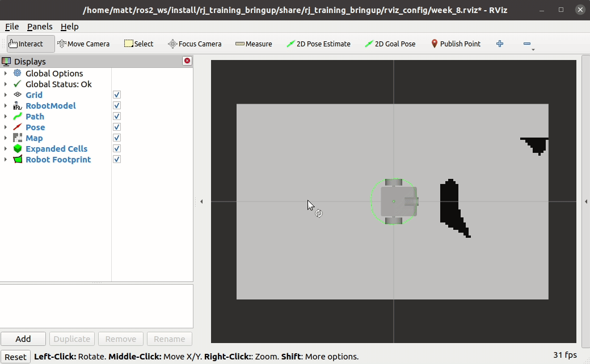

<!--
STOP
We strongly recommend viewing this file with a rendered markdown viewer. You can do this by:
 - Opening this file in the GitHub web viewer
 - Pressing Ctrl+Shift+V in Visual Studio Code
 - Opening this file in any other markdown viewer you prefer
-->

# Week 8 Project: A-Star Path Planning

<!-- START doctoc generated TOC please keep comment here to allow auto update -->
<!-- DON'T EDIT THIS SECTION, INSTEAD RE-RUN doctoc TO UPDATE -->
## Contents

- [1 Background](#1-background)
  - [1.1 The A* (A-Star) path planner](#11-the-a-a-star-path-planner)
  - [1.2 The code](#12-the-code)
- [2 Running this project](#2-running-this-project)
- [3 Instructions](#3-instructions)
  - [3.1 Get the latest starter code](#31-get-the-latest-starter-code)
  - [3.2 Implement IsGoal()](#32-implement-isgoal)
  - [3.3 Implement GetStepCost()](#33-implement-getstepcost)
  - [3.4 Implement GetHeuristicCost()](#34-implement-getheuristiccost)
  - [3.5 Implement GetAdjacentPoints()](#35-implement-getadjacentpoints)
  - [3.6 Implement ExtendPathAndAddToFrontier()](#36-implement-extendpathandaddtofrontier)
  - [3.7 Implement Plan()](#37-implement-plan)
  - [3.10 Commit your new code in git](#310-commit-your-new-code-in-git)

<!-- END doctoc generated TOC please keep comment here to allow auto update -->

## 1 Background

So far, our robot has been able to identify obstacles and map the world around it, but it pays no attention to these obstacles while it's navigating around the world. This week, we'll be implementing a path planning algorithm that allows our robot to drive around without hitting obstacles.

### 1.1 The A* (A-Star) path planner

The planning algorithm we'll be implementing is call [A*](https://en.wikipedia.org/wiki/A*_search_algorithm) (pronounced "a star"). This is a graph-search algorithm which can efficiently find paths accounting for impassible obstacles and differently weighted parts of the world.

We won't describe the whole A* algorithm here (check out the videos for that). We will be implementing the functions which

- Define the structure of the search graph
- Define the action and heuristic costs
- Traverse the graph to search for paths

### 1.2 The code

The code we'll be writing this week will be in the [astar_path_planner package](../../astar_path_planner). Specifically, we'll be completing [astar_path_planner.cpp](../../astar_path_planner/src/astar_path_planner.cpp).

This file contains the function definitions for the `AStarPathPlanner` class. This class is used by `AStarPathPlannerPlugin`, which provides a `GlobalPlanner` plugin for the Nav2 navigation stack. Global planners are used to calculate paths between the robot's current location and a destination pose.

There are a number of helpers we've put together to make this code work. The first is the `Point` type alias for `Eigen::Vector2d`. We'll use this type to hold locations in our planning algorithm.

We've also defined types for the priority queue used for the A* frontier and the set used for holding the expanded nodes. These are defined at the start of the `AStarPathPlanner` declaration in [astar_path_planner.hpp](../../astar_path_planner/src/astar_path_planner.hpp).

The frontier priority queue holds `FrontierEntry` structs, which hold a path and the associated cost. This struct is defined in [utils.hpp](../../astar_path_planner/src/utils.hpp). We want the priority queue to sort entries by their cost, so we create a custom comparator object, `FrontierEntryComparator`. You can see more about how `std::priority_queue` uses this comparator on [cppreference.com](https://en.cppreference.com/w/cpp/container/priority_queue).

[utils.hpp](../../astar_path_planner/src/utils.hpp) and [utils.cpp](../../astar_path_planner/src/utils.cpp) also contain two helpers that let us store `Point` objects in a `std::unordered_set`. `PointEqualityComparator` and `PointHash` provide a comparator and hashing algorithm that work well with floating point locations at the scale we're working with. Again, you can find out more about the purposes these serve in the documentation for [`std::unordered_set`](https://en.cppreference.com/w/cpp/container/unordered_set).

## 2 Running this project

To run this week's project, you'll need to run one launch file:

```bash
$ ros2 launch rj_training_bringup week_8.launch.xml
```

As usual, this launch file will startup the simulator, rviz, and all of the other nodes the project requires.

In rviz, you should see the robot and the map it's capturing. Under the robot is a green circle, this is the footprint the robot uses for collision detection with mapped obstacles.

rviz has a tool we can use to ask the robot to drive to a destination pose. This is the "2D Goal Pose" button in the toolbar, above the viewport.


To set the destination pose, click the "2D Goal Pose" button. Then, click where you want the robot to drive to and drag in the direction you'd like the robot to face when it's done. The navigation stack will then kick into gear, planning and following the path to get the robot to the pose you selected.

Here's what things look like when everything's working:



## 3 Instructions

### 3.1 Get the latest starter code

To make sure you're starting with the latest starter code, pull from the git server in your copy of the software-training repository.

```bash
$ cd training_ws/src/software-training
$ git pull
```

You'll also want to make sure you've got the latest version of the training support library by running an apt package update.

```bash
$ sudo apt update
$ sudo apt upgrade
```

If you have done a different installation of stsl that is not through apt make sure to pull the latest code there.

### 3.2 Implement IsGoal()

This project will focus on implementing various functions used to make the A* path planner work. First up, `IsGoal()`.

`IsGoal()` takes in a location and returns whether or not that point is close enough to our destination to be considered in the goal state.

Because `Point` in our is actually `Eigen::Vector2d`, we can use Eigen operators. To find the distance between two `Vector2d` objects, we can take the norm of the difference. So, to check if the given point is our goal position, we'll see if the distance to our goal is less than a configurable threshold.

Find the student code block in the `IsGoal()` function and implement the function:

```c++
return (point - goal_).norm() < goal_threshold_;
```

### 3.3 Implement GetStepCost() and GetHeuristicCost()

Next, we need to define the step cost and heuristic functions the A* planner will use. The step cost is the cost we assign to the robot moving from one graph node to the next. The heuristic is an estimate of the remaining cost from any node to the goal.

When using A*, we need to pick our step cost and heuristic functions such that they are ["admissable"](https://en.wikipedia.org/wiki/A*_search_algorithm#Admissibility). One easy set of admissable cost and heuristic for 2D path planning is the euclidean distance between points.

Find the student code block in `GetStepCost()`. Implement this function such that it returns the distance between `next` and `point`. (This should use the same subtract and `norm()` approach we used in `IsGoal()`.)

Next, find the student code block in `GetHeuristicCost()`. Implement this function such that it returns the distance between `point` and `goal_`. This implementation will look very similar to the previous one.

### 3.4 Implement GetAdjacentPoints()

Next, we need to define the structure of the graph used for our search. To do this, we need to answer the question "From any given point, what other points can be reached in one step?" In our case, we'll lay out a grid and allow for movement to any of the eight points adjacent to the current point. This includes diagonal movements. The distance between points in the grid is given as `grid_size_`.

Find the student code block in `GetAdjacentPoints()`. This function takes a point and returns all of the neighbors that can be reached from this point. We will exclude any neighbors that would cause a collision. We can check for collisions with the `IsPointInCollision()` function. By omitting neighbors that would colide, our search algorithm is limitted to finding paths that don't cause collisions.

To start, declare a new `std::vector` of `Point`s called `neighbors`.

Next, create a pair of nested for loops. The outer loop should iterate from `dx = -grid_size_` to `dx = grid_size_` in increments of `grid_size_`. The inner loop should do the same, but call its looping variable `dy`. These loops will now iterate over each of the nine grid points centered on the current point.

We don't want to consider our current point as a neighbor, so the first thing our inner loop body should do is check for that condition and skip that iteration. We can check for this by checking if both `dx` and `dy` are zero. Because these are floating point values, which don't behave well with equality checks, check instead if the absolute value of each is less than a very small number, like `1e-4`. If both values are zero (or nearly zero), continue to the next loop iteration.

After that check, declare a new variable `neighbor`. This should be a constant `Point` which we can initialize by adding `point` and `Point{dx, dy}`.

Then, if `IsPointInCollision(neighbor)` returns false, append `neighbor` to `neighbors`.

And finally, return `neighbors`.

### 3.5 Implement ExtendPathAndAddToFrontier()

The last helper or intermediate function we have to implement is `ExtendPathAndAddtoFrontier()`. This function takes in a path, with associated cost, and the next point we'd like to add to the path. Note that the path cost includes the heuristic value of the last point in the path. The job of this function is to extend the path with the new point, calculate the estimated cost of the new path (including heuristic), and push a new entry to the frontier.

Start by declaring a new `std::vector<Point>` named `new_path`. Initialize this by copying `path` with `std::vector`'s copy constructor.

Next, append `next_point` to `new_path`.

To calculate the cost of this new path, subtract the heuristic of the old path's last state from the old path's cost. Then, add the step cost to get from the old path's last state to the new point, and add the heuristic value for the new last point.

Finally, add a new entry to the frontier for this new path and cost:

```c++
frontier_.push({new_path, new_cost});
```

### 3.6 Implement Plan()

Now that all of our intermediate functions are implemented, we've fully defined our search problem, and it's time to implement the search algorithm. Find the student code block in `Plan()`.

First, we need to add our initial frontier entry. This entry has a path with just the starting point and its heuristic value.

```c++
frontier_.push({{start}, GetHeuristicCost(start)});
```

Next, create a while loop that repeats until `frontier_` is empty.

Inside this loop, we'll pull the next entry off the frontier with `top()` and `pop()`. `top()` gets the value and `pop()` removes it from the priority queue. Then we'll decompose our entry into its path, cost, and last state.

```c++
const auto entry = frontier_.top();
frontier_.pop();
const auto path = entry.path;
const auto cost = entry.cost;
const auto last_state = path.back();
```

The main purpose of this loop body is to expand the state we just popped off the frontier queue. Before we do that, we need to make sure we haven't already expanded this state before. We can check if `last_state` is already in our `expanded_` set using the `count()` function:

```c++
expanded_.count(last_state)
```

If `count()` returns a number greater than zero, continue to the next loop iteration.

Next, because we now know this is our first time trying to expand this state, we need to add `last_state` to `expanded_`. Do this with [the `insert()` function](https://en.cppreference.com/w/cpp/container/unordered_set/insert).

Now we need to check if the state we're expanding is our goal state. Check if `IsGoal(last_state)` returns true. If it does, return `path`. This will return from the `Plan()` function since we've found the path we were looking for.

After the goal check, get the neighbors reachable from `last_state` by calling `GetAdjacentPoints()`. Then, use [`std::for_each()`](https://en.cppreference.com/w/cpp/algorithm/for_each) to call `ExtendPathAndAddToFrontier()` on each neighbor. To pass this function in as the `std::for_each` operation, you'll need to wrap it in a lambda that captures `this`, `&path`, and `&cost`.

That's it for the body of the while loop. If our code makes it out of the loop without returning, we've exhausted the search space available to our search algorithm. We need to log the failure and return an empty path.

```c++
RCLCPP_ERROR(logger_, "No path found after exhausting search space.");
return {};
```

### 3.7 use rosbag


### 3.8 Commit your new code in git

Once you've got your code for this project working, use the command below to commit it into git. This will make it easier to grab changes to the starter code for the remaining projects.

```bash
$ git commit -a -m "My project 6 code."
```
