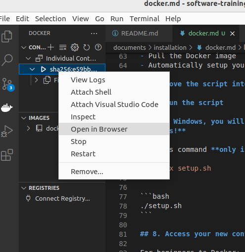
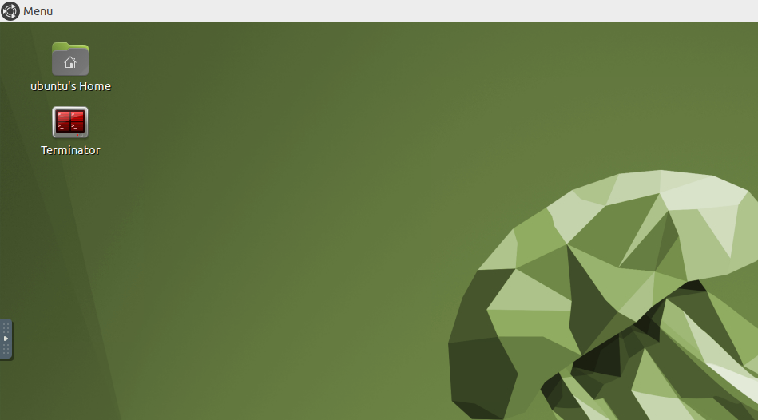

# Fall 2024 Enviornment SETUP

## Docker Installation

Doing a Docker installation is a great method for setting up the repository on any operating system
that isn't Ubuntu 22.04. It is a faster and more lightweight alternative to a traditional Virtual Machine.
In addition, you can still run GUI applications like Gazebo using the NoVNC desktop environment.

## 1. Install Docker

[Windows Instructions](https://docs.docker.com/desktop/windows/install/)

[Mac Instructions](https://docs.docker.com/desktop/mac/install/)

[Ubuntu Instructions](https://docs.docker.com/engine/install/ubuntu/)

> **_NOTE_**
> If you are on Linux, add yourself to the `docker` group. Being a member of the `docker` group allows you to run `docker` without `sudo`.
> ```bash
>   sudo groupadd docker
>   sudo usermod -aG docker $USER
> ```

After you complete the installation, **restart your computer**!

To check that everything installed OK, you should be able to open the command line and type:
```bash
docker
```

## 2. Install VS Code (Highly Recommended)

VS Code is the text editor of choice for most veteran RoboJackets members, thanks to its robust library of helpful extensions.

[Download VS Code here](https://code.visualstudio.com/Download)

### 2a. Install VS Code Extensions

Search for and install the following extensions in VS Code

* [Docker](https://marketplace.visualstudio.com/items?itemName=ms-azuretools.vscode-docker)
* [ROS](https://marketplace.visualstudio.com/items?itemName=ms-iot.vscode-ros)
* [C/C++](https://marketplace.visualstudio.com/items?itemName=ms-vscode.cpptools)
* [CMake](https://marketplace.visualstudio.com/items?itemName=twxs.cmake)

## 3. Install Git

[Install Git using the instructions here](https://git-scm.com/book/en/v2/Getting-Started-Installing-Git)

1. clone this repo
    ```bash
        git clone https://github.com/RoboJackets/software-training-old.git
    ```

## 4. Create directory to mount container

The docker container is essentially a self-contained instance of Ubuntu 22.04, with access to any files in the directory you mount it in. We do this so the container can see the repositories you clone locally, that way both local development and containerized testing can be done seamlessly. 

**You can place this directory wherever you want**, I recommend `/home` for Mac/Linux and `C:\Users\[Username]\` for Windows
1. Open Terminal

1. create a directory where robojackets material will live
    ```bash
    mkdir rj_training_container
    ```

## 5. Download and run our installation script.

Our installation script will:
- Make sure you have all necessary software
- Clone all necessary repos
- Pull the Docker image
- Automatically setup your desktop NoVNC environment

1. Go to your `rj_training_container` directory

   ```bash
   cd rj_training_container
   ```

1. Download the script

   ```bash
   wget https://github.com/RoboJackets/software-training-old/blob/main/setup_instructons/setup.sh
   ```

1. Run the script

   ```bash
   bash setup.sh
   ```


## 8. Access your new container

For beginners to Docker:
- Go to `http://localhost:6060` in your web browser of choice

Recommended way:
- Open up VS Code 
- Click on the whale Docker icon on your left
- Right click the currently running container (Green arrow next to name)
- Select open in browser



## 9. Head to your mounted directory

Open terminator on the desktop (this is the recommended terminal for commands in your container)

> ** _TIP_** extend your terminal scroll
> right click on terminator -> navigate to profiles -> profile preferences -> scrolling -> set to a pretty high number (beware of RAM usage)



In terminator, run
```bash
cd rj_training_container
```

## 10. Get necessary packages

First, it's always a good idea to check for updates. Nothing will happen if you just created the image. However, if you decide to re-create the container a while after you made the initial image, you will need to update those packages.

```bash
sudo apt update
sudo apt upgrade
```

## Software Training Support Library Download

> **_NOTE_** bash script should have installed stsl and software training old, if you can not find the directory then install them manually/ move stsl into `/training_ws/src`
```bash
cd /training_ws/src
```
```bash
git clone https://github.com/RoboJackets/stsl.git
```


## Install ROS Dependencies
```bash
cd /training_ws
rosdep update && rosdep install --from-paths src --ignore-src -r -y
```


## Colcon Build
1. Navigate to training_ws
    ```bash
    cd /training_ws
    ```

1. Run Colcon
    ```bash
    colcon build
    ```
> **_NOTE_** if this is failing:
> - check that `stsl` exists in the directory `/training_ws/src` 
> - run `source `/opt/ros/humble/setup.bash`
> - make sure you have enough RAM available

1. source the result for future projects
    ```bash
    source install/setup.bash
    ```

# You've set up your enviornemnt. Congratulations! 

## DEBUG COMMANDS

get the apt package for a given ros package

```
rosdep resolve <package>
```
search for things
```bash
apt-cache search
```
shows you info

```bash
apt-cache policy
```
see what src packages are curretly available to us
```bash
colcon list
```
